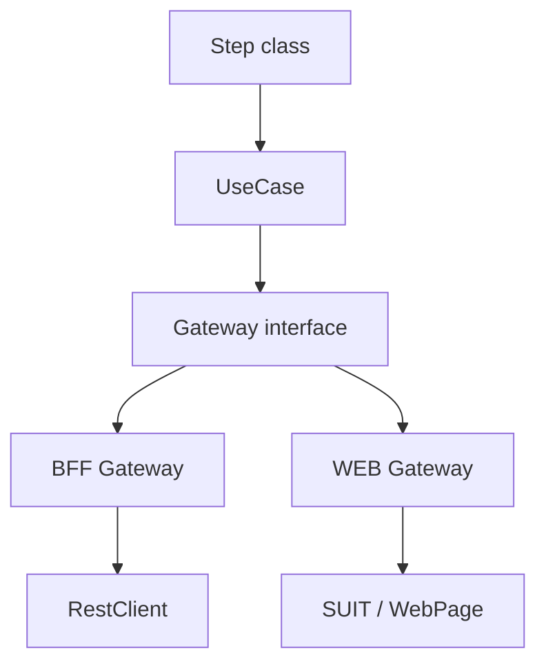

# Product Module Architecture

This document describes the Clean Architecture structure used inside product modules such as `interop` and `send`.

The goal is to keep business intent independent from the execution channel and to isolate technical details inside the infrastructure layer.

## Product module structure

A product module is organized first by execution channel and then vertically by business entity or capability.

Typical top-level structure:

```text
<product-module>/
├── common/
├── bff/
└── web/
```

Each vertical slice applies Clean Architecture:

```text
<channel-or-common>/<business-entity>/
├── domain/
├── application/
└── infrastructure/
```

## Channel scope

### `common`

Contains capabilities that are shared across multiple execution channels.

Business concepts and application contracts should live here whenever they are channel-agnostic.

### `bff`

Contains BFF-specific infrastructure implementations.

Typical responsibilities include:

- Gateway implementations for the BFF channel
- RestClient implementations
- request/response mapping
- channel-specific factories
- technical configuration

### `web`

Contains WEB-specific infrastructure implementations.

Typical responsibilities include:

- Gateway implementations for the WEB channel
- Page Objects
- reusable UI components
- SUIT-based interactions
- technical configuration

## Clean Architecture layers

### `domain`

Contains domain entities modeled specifically for the QA suite.

These models represent the business concepts used by tests and must remain independent from technical channel models.

Example:

```text
common/agreement/domain/
├── Agreement.java
├── AgreementRef.java
└── AgreementCreationFailureReason.java
```

### `application`

Contains the application-level business abstractions.

Typical contents include:

- UseCases
- Gateway interfaces
- optional Factory interfaces
- optional Command interfaces

A UseCase represents a high-level business intent and works with domain entities.

Example:

```java
@Service
@RequiredArgsConstructor
public class AgreementUseCase {

    private final AgreementGateway agreementGateway;

    public Agreement createAgreement(
            EService eService,
            EServiceDescriptor descriptor,
            @Nullable Delegation delegation) {

        return agreementGateway.createAgreement(
                eService,
                descriptor,
                delegation
        );
    }
}
```

The UseCase must not contain technical details related to HTTP, browser automation, selectors, payloads, polling, or concrete channel implementations.

### `infrastructure`

Contains concrete technical implementations.

Typical contents include:

- Cucumber Step classes and parameter types
- Gateway implementations
- RestClients
- Page Objects and SUIT-based components
- Spring configuration
- mappers
- concrete factories
- other channel-specific technical components

Infrastructure translates application-level business intent into concrete technical interactions.

## Dependency direction

Dependencies must point inward toward the business model.

```text
infrastructure -> application -> domain
```

The `domain` layer must not depend on `application` or `infrastructure`.

The `application` layer may depend on `domain`, but must not depend on concrete infrastructure implementations.

The `infrastructure` layer may depend on both `application` and `domain`.

## Business flow

The architectural flow for a business operation is:



The same business contract is implemented independently by each execution channel.

## UseCase responsibility

A UseCase represents a business desire at a high level.

Its method signatures should remain coarse-grained and business-oriented.

Because the repository is a test suite, UseCases may also model negative business expectations.

Example:

```java
public void shouldFailToCreateAgreement(
        EService eService,
        EServiceDescriptor descriptor,
        @Nullable Delegation delegation,
        AgreementCreationFailureReason reason) {

    agreementGateway.shouldFailToCreateAgreement(
            eService,
            descriptor,
            delegation,
            reason
    );
}
```

Negative expectations must expose an explicit failure `Reason`, so the expected failure remains understandable at business level.

## Gateway responsibility

The Gateway interface belongs to the `application` layer.

Each execution channel provides its own implementation in `infrastructure`.

Conceptually:

```text
UseCase
   ↓
Gateway interface
   ↓
┌───────────────────┬───────────────────┐
│ BFF Gateway       │ WEB Gateway       │
│       ↓           │       ↓           │
│ RestClient        │ SUIT / WebPage    │
└───────────────────┴───────────────────┘
```

A Gateway is responsible for:

- adapting the business request to the underlying channel
- mapping technical models to domain entities
- managing QA-specific infrastructure concerns
- updating shared test contexts such as the `EntityStore`
- handling polling and synchronization when required
- delegating low-level channel interaction to RestClient or SUIT/Page components

The UseCase must remain unaware of these technical details.

## BFF infrastructure

The BFF Gateway uses a RestClient.

The RestClient is a QA abstraction built around an API client generated through OpenAPI Generator and configured with RestAssured.

Conceptually:

```text
BFF Gateway
  ↓
RestClient
  ↓
Generated OpenAPI client
  ↓
RestAssured
```

The RestClient exposes a fluent interface that allows recurring QA infrastructure concerns to be expressed declaratively.

Example:

```java
restClient.create(payload)
        .withPolling(PollingStrategy.UNTIL_SUCCESS)
        .map(...)
        .get();
```

## WEB infrastructure

The WEB Gateway implements the same application contract through the frontend channel.

It delegates browser interaction to Page Objects and reusable components built on top of SUIT.

Conceptually:

```text
WEB Gateway
  ↓
Page Object / component
  ↓
SUIT
  ↓
Browser
```

The business contract remains stable while the channel-specific implementation changes.
