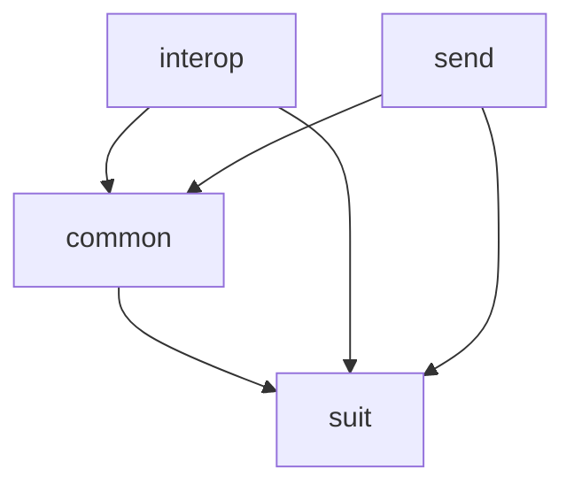

# Repository Map

This diagram shows the main internal modules of the repository and their dependency relationships.

Convention:

`A --> B` means **A depends on B**.

## Module roles

* `suit`: shared UI test automation framework.
* `common`: shared infrastructure, utilities, and reusable components used across product-specific modules. It depends on suit only where common UI components are implemented using framework abstractions.
* `interop`: Interop-specific test implementation.
* `send`: SEND-specific test implementation.

## Module boundaries
* `suit` must not contain product-specific logic.
* `common` must contain only functionality that is shared or intended to be reusable across product-specific modules.
* `interop` must contain Interop-specific behavior and test implementation.
* `send` must contain SEND-specific behavior and test implementation.
* Product-specific modules may depend on common and suit.
* Shared modules must not depend on product-specific modules.