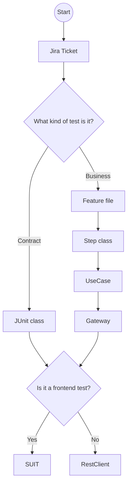

# Test Implementation Flow

This document describes the operational flow used to implement tests in the product-specific modules.

The flow distinguishes between **Business tests** and **Contract tests** and shows how both eventually reach the technical execution channel.

## Business tests

Business tests are defined through a Cucumber feature and implemented through the application layers:

`Feature file -> Step class -> UseCase -> Gateway`

The `UseCase` represents the business operation exercised by the test.

The `Gateway` represents the boundary between the business/application layer and the technical interaction layer.

## Contract tests

Contract tests are implemented directly through a JUnit class.

The JUnit test proceeds directly to the technical execution channel required by the scenario.

## Execution channel

The final interaction depends on the target under test:

- Frontend interaction -> `SUIT`
- Backend/API interaction -> `RestClient`
