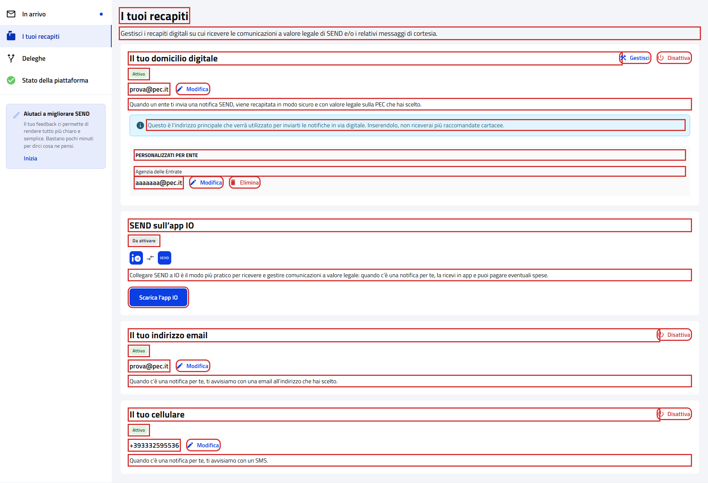
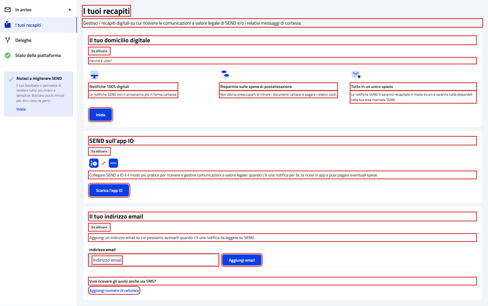

# WebAddressPFContractTest

Contract test della pagina **"I tuoi recapiti"** del cittadino.

- **Indirizzo:** `{baseUrl}/recapiti`, dalla voce "I tuoi recapiti" del menu laterale
- **Page Object:** [`AddressPFPage`](../../src/main/java/it/pagopa/send/web/destinatario_pf/infrastructure/page/AddressPFPage.java)
- **Test:** [`WebAddressPFContractTest`](../../src/test/java/it/pagopa/send/suite/contract/destinatario_pf/WebAddressPFContractTest.java)
- **Utente:** Lucrezia Borgia
- **Test di navigazione della pagina:** `WebRecipientPfNavigationContractTest#shouldReachAddressPF`, descritto in
  [WebRecipientPfNavigationContractTest.md](WebRecipientPfNavigationContractTest.md#i-tuoi-recapiti)

## Cosa verifica

L'`assertLoaded()` della pagina verifica solo che sia caricata: il titolo e le card del domicilio digitale, dell'app IO
e dell'email. È usato anche dagli step Cucumber dei recapiti. Questo contract test verifica:

- i **testi** della pagina e i titoli delle card;
- il **contenuto di ogni card**, nella variante mostrata all'utente;
- i **messaggi di validazione** dei recapiti da modificare o da aggiungere.

Nessuno scenario preme "Disattiva", "Elimina", "Gestisci" o "Inizia". Gli scenari di validazione usano solo valori non
validi anche senza spazi (`abc`, `123`): con un valore valido "Conferma", "Aggiungi email" e "Aggiungi numero"
avvierebbero la verifica del recapito.

## Le card dipendono dai recapiti dell'utente

Ogni scenario legge il contenuto della card e verifica la variante presente:

| Card | Recapito attivo (Lucrezia) | Recapito da attivare (utente senza recapiti) |
|---|---|---|
| Domicilio digitale | stato "Attivo", PEC, "Modifica", "Gestisci", "Disattiva", descrizione e avviso sull'indirizzo principale; se presenti, le PEC personalizzate per ente con ente, PEC, "Modifica" ed "Elimina" | stato "Da attivare", "Perché è utile?", i tre vantaggi e "Inizia" |
| SEND sull'app IO | — | stato "Da attivare", descrizione e "Scarica l'app IO" |
| Email | stato "Attivo", email, "Modifica", "Disattiva" e descrizione | stato "Da attivare", descrizione, campo "Indirizzo email" vuoto e "Aggiungi email" |
| Cellulare | card "Il tuo cellulare" con stato "Attivo", numero, "Modifica", "Disattiva" e descrizione | nella card dell'email, "Vuoi ricevere gli avvisi anche via SMS?" e "Aggiungi numero di cellulare", che apre il campo con "Aggiungi numero" e "Annulla" |

Il domicilio digitale attivo su SEND e SEND attivo sull'app IO non sono mostrati agli utenti di test: per l'app IO si
verifica solo lo stato. Con Lucrezia sono verificate le varianti dei recapiti attivi; le varianti da attivare sono state
eseguite l'08/10/2026 con un utente senza recapiti.

## Elementi verificati

In rosso gli elementi che il contract test legge e verifica, esclusi i messaggi di validazione.

Utente con recapiti attivi (Lucrezia):

Utente senza recapiti:

## Scenari

### Testi della pagina (`shouldShowAddressTexts`)

| Scenario | Cosa verifica |
|---|---|
| intestazione della pagina | titolo e sottotitolo |
| titoli delle card | "Il tuo domicilio digitale", "SEND sull'app IO" e "Il tuo indirizzo email" |

### Domicilio digitale (`shouldShowDigitalDomicileCard`)

| Scenario | Cosa verifica |
|---|---|
| se attivo su PEC, stato, PEC, pulsanti, descrizione e avviso | la card del domicilio attivo su PEC (vedi la tabella sopra) |
| se presenti, PEC personalizzate per ente con ente, PEC, modifica ed elimina | titolo "PERSONALIZZATI PER ENTE" e, per ogni ente, nome, PEC, "Modifica" ed "Elimina" |
| se da attivare, vantaggi del domicilio digitale e pulsante inizia | stato, "Perché è utile?", titoli e descrizioni dei tre vantaggi e "Inizia" |

### SEND sull'app IO (`shouldShowIoCard`)

| Scenario | Cosa verifica |
|---|---|
| stato e, se da attivare, descrizione e pulsante per scaricare l'app | stato presente; se "Da attivare", descrizione e "Scarica l'app IO" |

### Email e cellulare (`shouldShowCourtesyCards`)

| Scenario | Cosa verifica |
|---|---|
| email: se attiva stato, email, modifica, disattiva e descrizione; altrimenti campo per aggiungerla | la variante della card dell'email (vedi la tabella sopra) |
| cellulare: se attivo stato, numero, modifica, disattiva e descrizione; altrimenti domanda e pulsante per aggiungerlo | la card del cellulare oppure la domanda e "Aggiungi numero di cellulare" |
| se da aggiungere, aggiungi numero di cellulare apre il campo con aggiungi numero e annulla | il clic apre il campo "Il tuo cellulare" vuoto con "Aggiungi numero" e "Annulla" |

### Validazioni (`shouldValidateAddressForm`)

I messaggi compaiono dopo il clic sul pulsante. Ogni scenario si esegue solo se il recapito è nello stato giusto: con
Lucrezia le modifiche, con un utente senza recapiti gli inserimenti.

| Scenario | Cosa verifica |
|---|---|
| se attiva, modifica PEC del domicilio non valida | "Indirizzo PEC non valido" dopo "Modifica" e "Conferma" |
| se attiva, modifica PEC del domicilio vuota | "Indirizzo PEC non valido" dopo "Modifica" e "Conferma" |
| se presente, modifica PEC per ente non valida | "Indirizzo PEC non valido" sulla prima PEC per ente |
| se presente, modifica PEC per ente vuota | "Indirizzo PEC non valido" sulla prima PEC per ente |
| se attiva, modifica email non valida | "Indirizzo email non valido" dopo "Modifica" e "Conferma" |
| se attiva, modifica email vuota | "Indirizzo email non valido" dopo "Modifica" e "Conferma" |
| se attivo, modifica cellulare non valido | "Numero di cellulare non valido" dopo "Modifica" e "Conferma" |
| se attivo, modifica cellulare vuoto | "Numero di cellulare non valido" dopo "Modifica" e "Conferma" |
| se da aggiungere, email non valida | "Indirizzo email non valido" dopo "Aggiungi email" |
| se da aggiungere, email vuota | "Indirizzo email non valido" dopo "Aggiungi email" |
| se da aggiungere, email non valida con spazi all'inizio o alla fine | "Indirizzo email non valido": in questo campo gli spazi non hanno un messaggio dedicato |
| se da aggiungere, cellulare non valido | "Numero di cellulare non valido" dopo "Aggiungi numero" |
| se da aggiungere, cellulare vuoto | "Numero di cellulare non valido" dopo "Aggiungi numero" |
| se da aggiungere, cellulare con spazi all'inizio o alla fine | "Elimina gli spazi all'inizio o alla fine" dopo "Aggiungi numero" |
