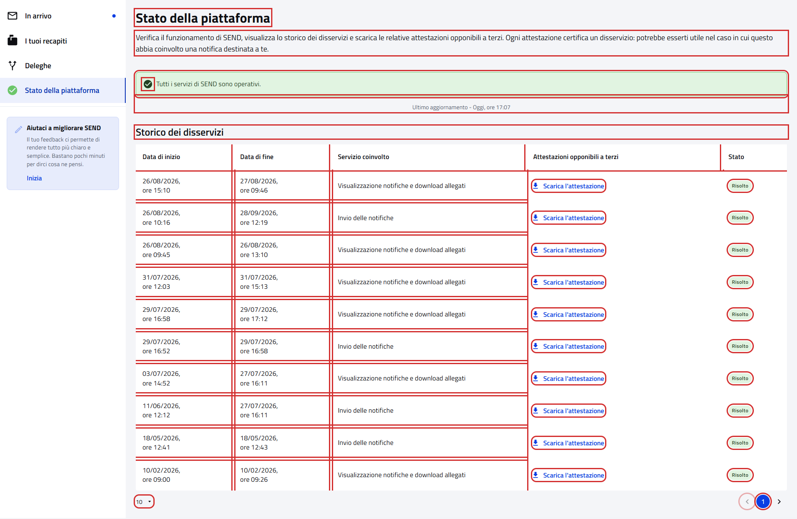

# WebAppStatusPFContractTest

Contract test della pagina **"Stato della piattaforma"** del cittadino.

- **Indirizzo:** `{baseUrl}/app-status`, dalla voce "Stato della piattaforma" del menu laterale
- **Page Object:** [`AppStatusPFPage`](../../src/main/java/it/pagopa/send/web/destinatario_pf/infrastructure/page/AppStatusPFPage.java)
- **Test:** [`WebAppStatusPFContractTest`](../../src/test/java/it/pagopa/send/suite/contract/WebAppStatusPFContractTest.java)
- **Utente:** Lucrezia Borgia (la pagina è la stessa per qualunque cittadino)
- **Test di navigazione della pagina:** `WebRecipientPfNavigationContractTest#shouldReachAppStatusPF`, descritto in
  [WebRecipientPfNavigationContractTest.md](WebRecipientPfNavigationContractTest.md#stato-della-piattaforma)

## Cosa verifica

L'`assertLoaded()` della pagina verifica solo che sia caricata: il titolo, lo stato attuale e l'ultimo aggiornamento.
Questo contract test verifica:

- i **testi** della pagina;
- lo **stato attuale** dei servizi e l'ora dell'ultimo aggiornamento;
- lo **storico dei disservizi** e la sua paginazione.

Nessuno scenario scarica le attestazioni.

## Stato e storico cambiano nel tempo

Stato attuale e storico dipendono dai disservizi registrati dalla piattaforma, non dall'utente. Il test verifica i testi
fissi e il **formato** dei dati, non i loro valori:

| Parte | Cosa si verifica |
|---|---|
| stato attuale | se tutti i servizi sono operativi, il messaggio "Tutti i servizi di SEND sono operativi." e l'icona verde; durante un disservizio il messaggio cambia e si verifica solo che ci sia |
| ultimo aggiornamento | formato "Ultimo aggiornamento - &lt;giorno&gt;, ore hh:mm" |
| storico | se presente: intestazioni delle colonne e, su ogni riga, data di inizio `gg/mm/aaaa, ore hh:mm`, servizio e stato; per i disservizi risolti anche la data di fine e "Scarica l'attestazione" |
| paginazione | se presente: 10 righe per pagina, prima pagina selezionata e "Indietro" disabilitato |

Il 07/10/2026 sull'ambiente di test tutti i servizi erano operativi e lo storico aveva più di 10 disservizi risolti:
sono stati eseguiti i rami con lo storico e la paginazione. Il caso di un disservizio in corso non si può provocare
dal test e non è stato eseguito.

## Elementi verificati

In rosso gli elementi che il contract test legge e verifica, esclusi i messaggi di validazione.

## Scenari

### Testi della pagina (`shouldShowAppStatusTexts`)

| Scenario | Cosa verifica |
|---|---|
| intestazione della pagina | titolo e sottotitolo |
| titolo dello storico dei disservizi | "Storico dei disservizi" |

### Stato attuale (`shouldShowCurrentStatus`)

| Scenario | Cosa verifica |
|---|---|
| stato attuale: se tutti i servizi sono operativi, messaggio e icona verde | messaggio presente; se tutti i servizi sono operativi, il testo esatto e l'icona verde |
| data e ora dell'ultimo aggiornamento | formato dell'ultimo aggiornamento |

### Storico dei disservizi (`shouldShowDowntimeHistory`)

| Scenario | Cosa verifica |
|---|---|
| se presente, tabella dello storico con date, servizio, attestazione e stato su ogni riga | intestazioni e contenuto di ogni riga (vedi la tabella sopra) |
| se presente, paginazione dello storico alla prima pagina | 10 righe per pagina, pagina 1, "Indietro" disabilitato e al massimo 10 righe |
