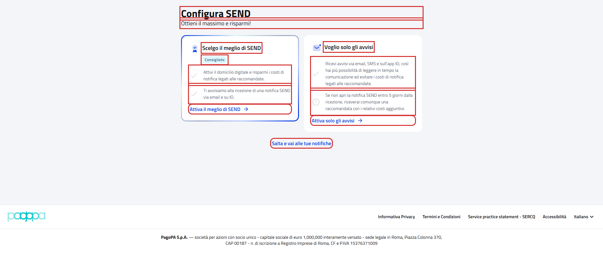

# WebConfigureAddressSendPFContractTest

Contract test della pagina di onboarding **"Configura SEND"** del cittadino.

- **Indirizzo:** `{baseUrl}/onboarding`, mostrata al primo accesso al portale finché l'utente non configura SEND o salta
  la configurazione; sempre raggiungibile dall'indirizzo e dal pulsante "Esci" delle pagine di onboarding
- **Page Object:** [`ConfigureAddressSendPage`](../../src/main/java/it/pagopa/send/web/infrastructure/page/ConfigureAddressSendPage.java)
- **Test:** [`WebConfigureAddressSendPFContractTest`](../../src/test/java/it/pagopa/send/suite/contract/destinatario_pf/WebConfigureAddressSendPFContractTest.java)
- **Utente:** Lucrezia Borgia
- **Test di navigazione della pagina:** `WebRecipientPfNavigationContractTest#shouldReachOnboardingPF`, descritto in
  [WebRecipientPfNavigationContractTest.md](WebRecipientPfNavigationContractTest.md#configura-send-onboarding)

## Cosa verifica

L'`assertLoaded()` della pagina verifica solo che sia caricata: il titolo e la presenza dei pulsanti delle due card
mostrate a tutti e di "Salta e vai alle tue notifiche". Questo contract test verifica:

- i **testi** della pagina e delle card;
- i **pulsanti** e la pagina che apre ciascuna card.

Nessuno scenario preme "Salta e vai alle tue notifiche", che segna la configurazione come fatta, né conferma le pagine
aperte dalle card.

La pagina è condivisa con Cucumber: lo step "se presente, viene saltata la configurazione del prodotto SEND" usa
l'`assertLoaded()` per capire se la pagina è mostrata.

## Le card dipendono dai recapiti dell'utente

| Card | Pulsante | Apre | Mostrata a |
|---|---|---|---|
| Scelgo il meglio di SEND | Attiva il meglio di SEND | wizard "Il meglio di SEND" (`{baseUrl}/onboarding/domicilio-digitale`) | tutti |
| Voglio solo gli avvisi | Attiva solo gli avvisi | wizard "Attivazione avvisi" (`{baseUrl}/onboarding/avvisi`) | tutti |
| Preferisco attivare solo SEND sull'app IO | Attiva SEND su IO | pagina "Tutto, sull'app IO" (`{baseUrl}/onboarding/io`) | solo agli utenti **senza recapiti di cortesia** (email, SMS o app IO) |

La terza card è l'unico modo di arrivare alla pagina "Tutto, sull'app IO" dal portale. Gli scenari della terza card
leggono prima quali card sono mostrate e la verificano solo se c'è: Lucrezia ha email e SMS di cortesia e non la vede;
il ramo con la card è stato eseguito il 07/10/2026 con un utente senza recapiti di cortesia.

## Elementi verificati

In rosso gli elementi che il contract test legge e verifica, esclusi i messaggi di validazione.

## Scenari

### Testi della pagina e delle card (`shouldShowConfigureSendTexts`)

| Scenario | Cosa verifica |
|---|---|
| intestazione della pagina | titolo "Configura SEND" e sottotitolo |
| card il meglio di SEND | titolo, etichetta "Consigliato" e i due punti della card |
| card solo avvisi | titolo e i due punti della card |

### Pulsanti (`shouldShowConfigureSendButtons`)

| Scenario | Cosa verifica |
|---|---|
| pulsanti delle card e per saltare la configurazione | testo di "Attiva il meglio di SEND", "Attiva solo gli avvisi" e "Salta e vai alle tue notifiche" |
| attiva il meglio di SEND apre il wizard il meglio di SEND | il clic apre il wizard (verificato con il suo `assertLoaded()`) |
| attiva solo gli avvisi apre il wizard attivazione avvisi | il clic apre il wizard (verificato con il suo `assertLoaded()`) |

### Terza card (`shouldShowConfigureSendIoCard`)

| Scenario | Cosa verifica |
|---|---|
| se presente, testi della card app IO | titolo, i due punti e il pulsante "Attiva SEND su IO" |
| se presente, attiva SEND su IO apre la pagina tutto, sull'app IO | il clic apre la pagina "Tutto, sull'app IO" (verificata con il suo `assertLoaded()`) |
