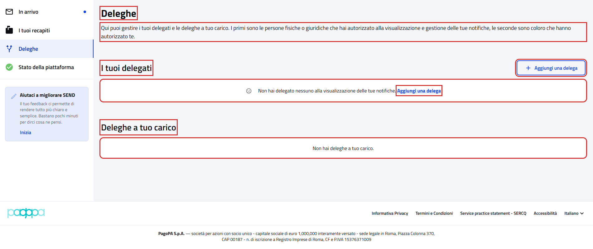
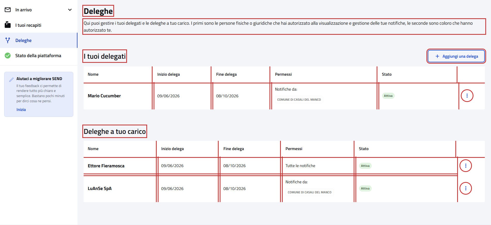

# Deleghe

Pagina `{baseUrl}/deleghe`, dalla voce "Deleghe" del menu laterale.

- Page object: [`DelegationsPFPage`](../../src/main/java/it/pagopa/send/web/destinatario_pf/infrastructure/page/DelegationsPFPage.java)
- Test: [`WebDelegationsPFContractTest`](../../src/test/java/it/pagopa/send/suite/contract/destinatario_pf/WebDelegationsPFContractTest.java)
- Utente: Lucrezia Borgia
- Navigazione: `WebRecipientPfNavigationContractTest#shouldReachDelegationsPF`, vedi
  [WebRecipientPfNavigationContractTest.md](WebRecipientPfNavigationContractTest.md#deleghe)

## La pagina

In rosso quello che controlla `assertLoaded()`: il titolo, "Aggiungi una delega" e le due sezioni.

## Cosa verifica il contract test

I testi della pagina e delle sezioni, il pulsante e il link "Aggiungi una delega" con la pagina che aprono, e il
contenuto di "I tuoi delegati" e "Deleghe a tuo carico". In rosso gli elementi controllati.

Senza deleghe (Lucrezia):

Con delegati e deleghe a carico:

## Varianti

Ogni sezione mostra un messaggio se è vuota, altrimenti la tabella delle deleghe. Il test controlla quello che trova.

| Sezione | Vuota | Con deleghe |
|---|---|---|
| I tuoi delegati | "Non hai delegato nessuno…" e il link "Aggiungi una delega" | colonne e, per ogni riga, nome, date `gg/mm/aaaa`, permessi, stato e menu |
| Deleghe a tuo carico | "Non hai deleghe a tuo carico." | come sopra; lo stato può essere "Accetta" |

Le tabelle con le deleghe sono state provate il 06/10/2026 con un utente che ha sia delegati sia deleghe a carico.

## Note

- Il test non crea, accetta, rifiuta o revoca deleghe.
- Le due tabelle hanno la stessa struttura e usano lo stesso componente, `DelegationsTable`.
