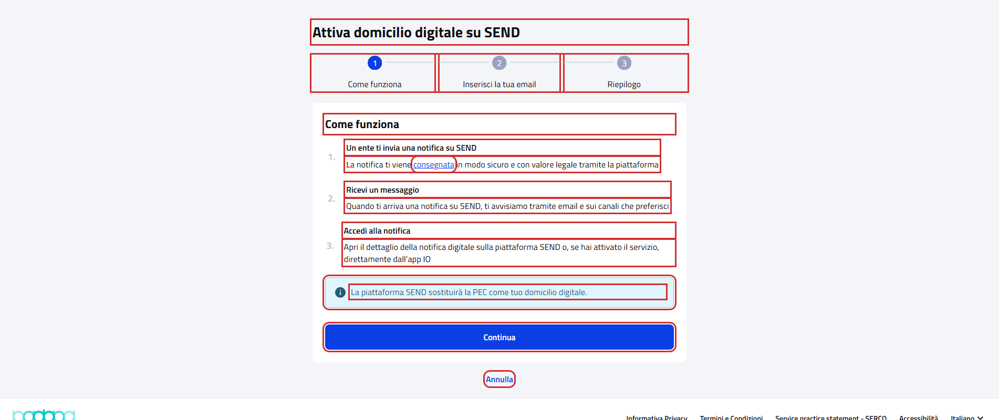
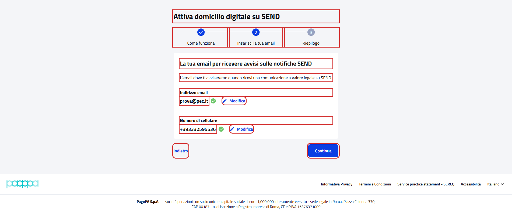
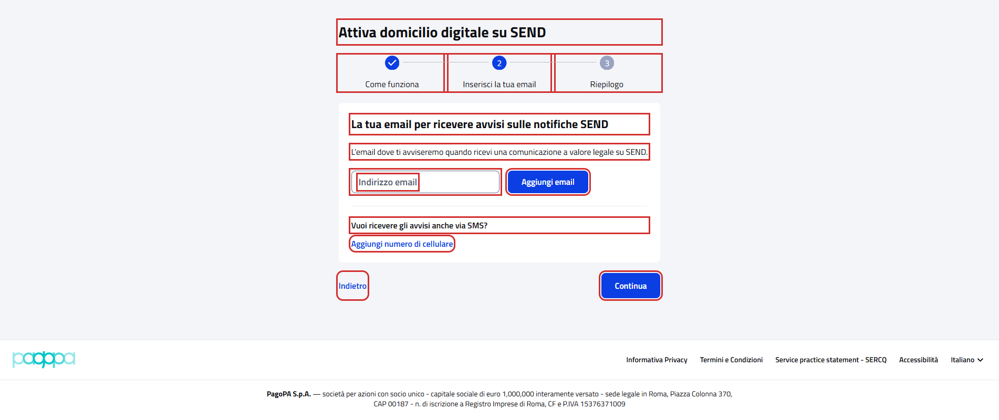
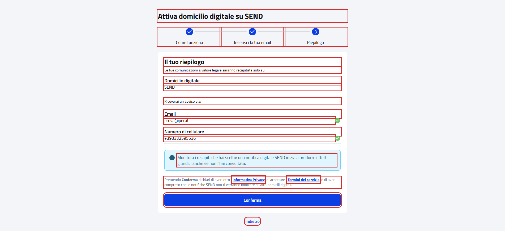

# WebDigitalDomicileActivationPFContractTest

Contract test del wizard **"Attiva domicilio digitale su SEND"** del cittadino.

- **Indirizzo:** `{baseUrl}/recapiti/domicilio-digitale/attivazione`, dalla card domicilio digitale di "I tuoi recapiti"
- **Page Object:** [`DigitalDomicileActivationPFPage`](../../src/main/java/it/pagopa/send/web/destinatario_pf/infrastructure/page/DigitalDomicileActivationPFPage.java)
- **Test:** [`WebDigitalDomicileActivationPFContractTest`](../../src/test/java/it/pagopa/send/suite/contract/destinatario_pf/WebDigitalDomicileActivationPFContractTest.java)
- **Utente:** Lucrezia Borgia
- **Test di navigazione della pagina:** `WebRecipientPfNavigationContractTest#shouldReachDigitalDomicileActivationPF`, descritto in
  [WebRecipientPfNavigationContractTest.md](WebRecipientPfNavigationContractTest.md#attiva-domicilio-digitale-su-send)

## Cosa verifica

L'`assertLoaded()` della pagina verifica solo che sia caricata: il titolo del wizard, i tre passi, "Continua" e
"Annulla". Questo contract test verifica:

- i **testi comuni** a tutti i passi (titolo e nomi dei passi);
- **testi e pulsanti di ogni passo**: "Come funziona", "Inserisci la tua email" e "Riepilogo";
- i **messaggi di validazione** dell'email e del cellulare al secondo passo.

Nessuno scenario preme "Conferma", che attiva il domicilio digitale. Gli scenari di validazione usano solo valori non
validi anche senza spazi (`abc`, `123`): con un valore valido "Conferma", "Aggiungi email" e "Aggiungi numero"
avvierebbero la verifica del recapito.

## Il secondo passo e il riepilogo dipendono dai recapiti dell'utente

| Passo | Utente con email e cellulare (Lucrezia) | Utente senza recapiti |
|---|---|---|
| 1. Come funziona | avviso "La piattaforma SEND sostituirà la PEC come tuo domicilio digitale." (Lucrezia ha una PEC) | nessun avviso |
| 2. Inserisci la tua email | email e cellulare con "Modifica" | campo "Indirizzo email" vuoto con "Aggiungi email", "Vuoi ricevere gli avvisi anche via SMS?" e "Aggiungi numero di cellulare" |
| 3. Riepilogo | raggiungibile con "Continua" | non raggiungibile: "Continua" lascia al secondo passo, senza messaggi |

Con Lucrezia sono verificate le varianti con i recapiti; quelle senza recapiti sono state eseguite l'08/10/2026 con un
utente senza recapiti.

## Elementi verificati

In rosso gli elementi che il contract test legge e verifica, esclusi i messaggi di validazione e la finestra di
"consegnata".

Passo 1, Come funziona (Lucrezia):

Passo 2, Inserisci la tua email, con email e cellulare (Lucrezia):

Passo 2, Inserisci la tua email, utente senza recapiti:

Passo 3, Riepilogo (il pulsante Conferma non viene premuto):

## Scenari

### Testi comuni (`shouldShowActivationWizardTexts`)

| Scenario | Cosa verifica |
|---|---|
| titolo e nomi dei passi | "Attiva domicilio digitale su SEND" e "Come funziona", "Inserisci la tua email", "Riepilogo" (senza il numero del passo corrente) |

### Passo 1: Come funziona (`shouldShowHowItWorksStep`)

| Scenario | Cosa verifica |
|---|---|
| passo come funziona con i tre punti, continua e annulla | titolo, titoli e descrizioni dei tre punti, link "consegnata", "Continua" e "Annulla" |
| se l'utente ha già una PEC, avviso che SEND la sostituirà | il testo dell'avviso, se presente |
| consegnata apre la finestra sul valore giuridico della notifica | titolo e descrizione della finestra e "Ok, ho capito" |

"Annulla" torna alla pagina precedente nella cronologia del browser, che dipende da come si arriva al wizard: per questo
si verifica solo il testo del pulsante.

### Passo 2: Inserisci la tua email (`shouldShowEmailStep`)

| Scenario | Cosa verifica |
|---|---|
| passo email: titolo, descrizione, indietro e, se presenti, email e cellulare con modifica | titolo, descrizione, "Indietro" e la variante del passo (vedi la tabella sopra) con "Continua" |
| se l'email è da aggiungere, continua non porta al riepilogo | dopo "Continua" il passo corrente resta "Inserisci la tua email" |

### Passo 3: Riepilogo (`shouldShowSummaryStep`)

Gli scenari si eseguono solo se il riepilogo è raggiungibile, cioè se l'utente ha un'email di cortesia.

| Scenario | Cosa verifica |
|---|---|
| se raggiungibile, riepilogo con domicilio SEND, recapiti, disclaimer e conferma non premuta | titolo, "Domicilio digitale" con valore "SEND", "Riceverai un avviso via:" con tipo e valore di ogni recapito, avviso "Monitora i recapiti...", disclaimer, "Indietro" e il testo di "Conferma" |
| se raggiungibile, link a informativa privacy e termini del servizio SERCQ in una nuova scheda | testi dei link e indirizzi `/informativa-privacy` e `/termini-di-servizio/sercq-send` |

### Validazioni (`shouldValidateEmailStep`)

I messaggi compaiono dopo il clic sul pulsante. Ogni scenario si esegue solo se il recapito è nello stato giusto: con
Lucrezia le modifiche, con un utente senza recapiti gli inserimenti.

| Scenario | Cosa verifica |
|---|---|
| se presente, modifica email non valida | "Indirizzo email non valido" dopo "Modifica" e "Conferma" |
| se presente, modifica email vuota | "Indirizzo email non valido" dopo "Modifica" e "Conferma" |
| se presente, modifica cellulare non valido | "Numero di cellulare non valido" dopo "Modifica" e "Conferma" |
| se presente, modifica cellulare vuoto | "Numero di cellulare non valido" dopo "Modifica" e "Conferma" |
| se da aggiungere, email non valida | "Indirizzo email non valido" dopo "Aggiungi email" |
| se da aggiungere, email vuota | "Indirizzo email non valido" dopo "Aggiungi email" |
| se da aggiungere, cellulare non valido | "Numero di cellulare non valido" dopo "Aggiungi numero" |
| se da aggiungere, cellulare vuoto | "Numero di cellulare non valido" dopo "Aggiungi numero" |
