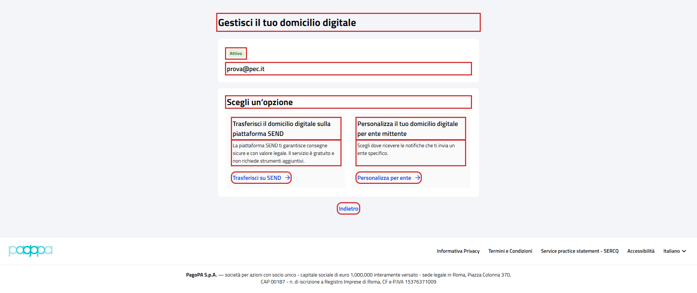
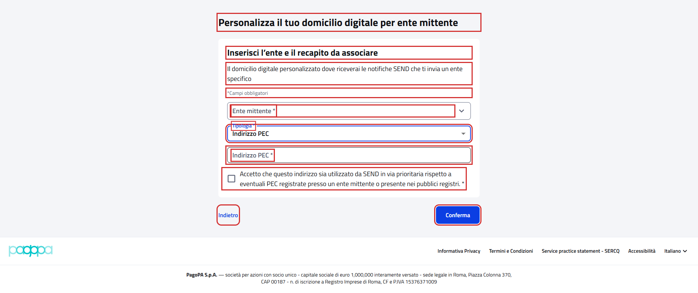

# WebDigitalDomicileManagementPFContractTest

Contract test della pagina **"Gestisci il tuo domicilio digitale"** del cittadino.

- **Indirizzo:** `{baseUrl}/recapiti/domicilio-digitale/gestione`, dal pulsante "Gestisci" della card domicilio digitale
  in "I tuoi recapiti"
- **Page Object:** [`DigitalDomicileManagementPFPage`](../../src/main/java/it/pagopa/send/web/destinatario_pf/infrastructure/page/DigitalDomicileManagementPFPage.java)
- **Test:** [`WebDigitalDomicileManagementPFContractTest`](../../src/test/java/it/pagopa/send/suite/contract/WebDigitalDomicileManagementPFContractTest.java)
- **Utente:** Lucrezia Borgia (domicilio digitale attivo su PEC)
- **Test di navigazione della pagina:** `WebRecipientPfNavigationContractTest#shouldReachDigitalDomicileManagementPF`, descritto in
  [WebRecipientPfNavigationContractTest.md](WebRecipientPfNavigationContractTest.md#gestisci-il-tuo-domicilio-digitale)

## Cosa verifica

L'`assertLoaded()` della pagina verifica solo che sia caricata: il titolo, "Personalizza per ente" e "Indietro".
Questo contract test verifica:

- i **testi** della pagina e il **domicilio attivo** (stato e indirizzo);
- le **opzioni** "Trasferisci su SEND" e "Personalizza per ente" e cosa aprono;
- il **form "Personalizza per ente"** e i suoi **messaggi di validazione**.

La pagina è disponibile solo a un utente con un domicilio digitale attivo. "Trasferisci su SEND" c'è solo con il
domicilio su PEC: con il domicilio su SEND resta solo "Personalizza per ente" e gli scenari lo verificano se presente.
Il domicilio su SEND non è attivo per nessun utente di test.

Nessuno scenario conferma il wizard di trasferimento. Gli scenari del form lasciano sempre vuoto "Ente mittente", quindi
"Conferma" mostra solo i messaggi e non salva nulla; la PEC usata è solo non valida (`abc`) o vuota.

"Indietro" torna alla pagina precedente nella cronologia del browser, che dipende da come si arriva alla pagina: per
questo si verifica solo il testo del pulsante.

## Elementi verificati

In rosso gli elementi che il contract test legge e verifica, esclusi i messaggi di validazione, la tendina "Tipologia"
aperta e il wizard di trasferimento.

Pagina con le opzioni:

Form "Personalizza per ente" con tipologia "Indirizzo PEC":

## Scenari

### Testi e domicilio attivo (`shouldShowManagementTexts`)

| Scenario | Cosa verifica |
|---|---|
| titolo, titolo delle opzioni e indietro | "Gestisci il tuo domicilio digitale", "Scegli un’opzione" e "Indietro" |
| domicilio digitale attivo con stato e indirizzo | stato "Attivo" e indirizzo presente |

### Opzioni e form (`shouldShowManagementOptions`)

| Scenario | Cosa verifica |
|---|---|
| opzione personalizza per ente e, se domicilio su PEC, trasferisci su SEND | titoli, descrizioni e pulsanti delle opzioni presenti |
| se presente, trasferisci su SEND apre il wizard di trasferimento | titolo "Trasferisci il domicilio digitale sulla piattaforma SEND" e passi "Come funziona", "Inserisci la tua email", "Riepilogo" |
| personalizza per ente apre il form con ente, tipologia, conferma e indietro | titolo della pagina e del form, descrizione, "*Campi obbligatori", etichette "Ente mittente *" e "Tipologia *", ente vuoto, "Conferma" e "Indietro" |
| tipologia propone indirizzo PEC e domicilio digitale SEND | le due opzioni della tendina, in quest'ordine |
| tipologia indirizzo PEC aggiunge il campo PEC e l'accettazione | campo "Indirizzo PEC *" vuoto e testo della casella di accettazione |
| indietro del form torna alle opzioni | dopo "Indietro" titolo della pagina e "Scegli un’opzione" |

### Validazioni (`shouldValidateCustomizeBySenderForm`)

I messaggi compaiono dopo "Conferma".

| Scenario | Cosa verifica |
|---|---|
| form vuoto: ente e tipologia obbligatori | "Campo obbligatorio" su ente e tipologia |
| tipologia PEC con PEC non valida | "Indirizzo PEC non valido" sulla PEC, "Campo obbligatorio" su ente e accettazione |
| tipologia PEC con PEC vuota | "Indirizzo PEC non valido" sulla PEC, "Campo obbligatorio" su ente e accettazione |
