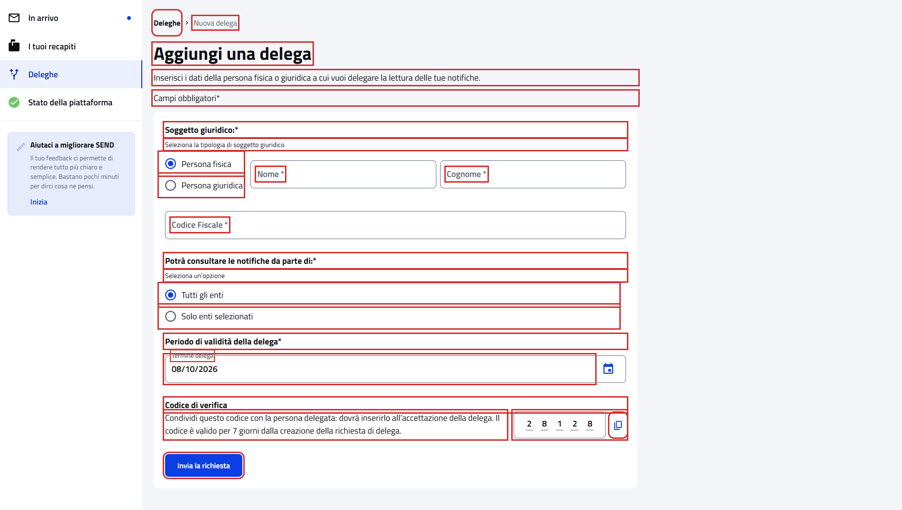
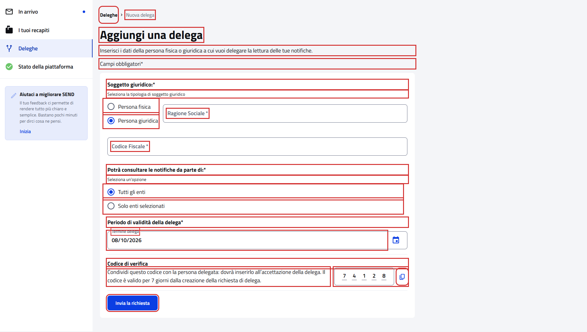
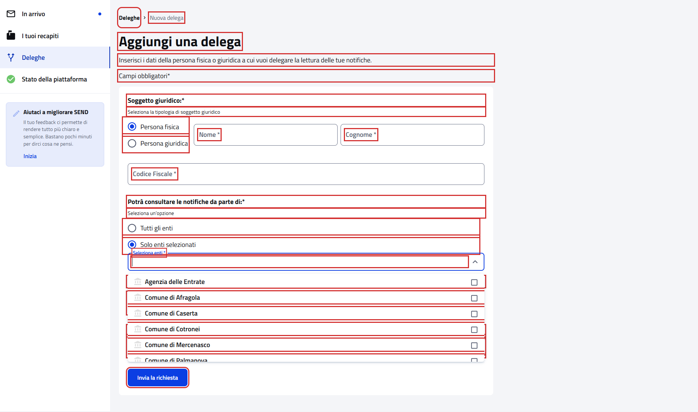

# WebNewDelegationPFContractTest

Contract test della pagina **"Aggiungi una delega"** del cittadino.

- **Indirizzo:** `{baseUrl}/deleghe/nuova`, dal pulsante "Aggiungi una delega" della pagina `{baseUrl}/deleghe`
- **Page Object:** [`NewDelegationPFPage`](../../src/main/java/it/pagopa/send/web/destinatario_pf/infrastructure/page/NewDelegationPFPage.java)
- **Test:** [`WebNewDelegationPFContractTest`](../../src/test/java/it/pagopa/send/suite/contract/WebNewDelegationPFContractTest.java)
- **Utente:** Lucrezia Borgia (il form è lo stesso per qualunque cittadino)
- **Test di navigazione della pagina:** `WebRecipientPfNavigationContractTest#shouldReachNewDelegationPF`, descritto in
  [WebRecipientPfNavigationContractTest.md](WebRecipientPfNavigationContractTest.md#aggiungi-una-delega)

## Cosa verifica

L'`assertLoaded()` della pagina verifica solo che sia caricata: il titolo e la presenza degli input e dei pulsanti del
form. Questo contract test verifica tutto il resto:

- i **testi** della pagina e del form (intestazione, etichette, descrizioni);
- lo **stato iniziale** del form;
- le **validazioni** dei campi e i messaggi di errore mostrati dal portale;
- i **campi che cambiano** in base alle scelte (persona fisica o giuridica, enti).

## Il form non viene mai inviato

Nessuno scenario crea una delega. Dove serve premere "Invia la richiesta" per far comparire i messaggi del portale, il
form contiene sempre un codice fiscale non valido (`INVALID_TAX_ID`), quindi l'invio viene bloccato dalla validazione.

Il form ha due livelli di validazione:

| Livello | Quando | Come appare | Verificabile dal test |
|---|---|---|---|
| browser | un campo obbligatorio è vuoto | fumetto "Compila questo campo." sul primo campo vuoto | no: il fumetto non fa parte della pagina |
| portale | il valore di un campo non è valido | campo rosso e messaggio sotto (`<id campo>-helper-text`) | sì: `getXxxErrorMessage()` della pagina |

Per questo gli scenari di validazione compilano i campi obbligatori, così il browser lascia passare l'invio e il
portale mostra i propri messaggi.

## Elementi verificati

In rosso gli elementi che il contract test legge e verifica, esclusi i messaggi di validazione.

All'apertura (persona fisica, tutti gli enti):

Persona giuridica: la ragione sociale al posto di nome e cognome:

Solo enti selezionati, con l'elenco degli enti aperto:

## Scenari

Il test è diviso in quattro gruppi, uno per aspetto della pagina. I nomi sono quelli che compaiono nel report dei
test; i testi attesi sono costanti in cima alla classe.

### Testi della pagina e del form (`shouldShowNewDelegationTexts`)

| Scenario | Cosa verifica |
|---|---|
| intestazione della pagina | titolo, breadcrumb, sottotitolo e indicazione dei campi obbligatori |
| scelta del soggetto giuridico | etichetta, descrizione e opzioni "Persona fisica" / "Persona giuridica" |
| campi della persona fisica | etichette di Nome, Cognome e Codice Fiscale |
| scelta degli enti | etichetta, descrizione e opzioni "Tutti gli enti" / "Solo enti selezionati" |
| periodo di validità della delega | etichette del periodo e del termine delega |
| codice di verifica | titolo e descrizione del codice di verifica |

### Elementi e pulsanti (`shouldShowNewDelegationElements`)

| Scenario | Cosa verifica |
|---|---|
| codice di verifica di 5 cifre con il pulsante per copiarlo | codice di 5 cifre e pulsante per copiarlo |
| pulsante di invio della richiesta | pulsante "Invia la richiesta" |
| persona giuridica: ragione sociale al posto di nome e cognome | scegliendo "Persona giuridica" compare il campo "Ragione Sociale" |
| solo enti selezionati: compare la scelta degli enti | scegliendo "Solo enti selezionati" compare il campo "Seleziona enti" |
| solo enti selezionati: l'elenco degli enti contiene almeno un ente | aprendo "Seleziona enti" compare l'elenco degli enti (non si verificano i nomi: dipendono dagli enti attivi sulla piattaforma) |

### Stato iniziale del form (`shouldStartWithDefaultValues`)

| Scenario | Cosa verifica |
|---|---|
| persona fisica selezionata | "Persona fisica" è selezionata all'apertura |
| tutti gli enti selezionati | "Tutti gli enti" è selezionato all'apertura |
| termine delega precompilato a domani | il termine delega è la data di domani |

### Validazioni (`shouldValidateNewDelegationForm`)

| Scenario | Cosa verifica |
|---|---|
| codice fiscale non valido | messaggio di errore sul codice fiscale di una persona fisica |
| nome con spazi all'inizio o alla fine | messaggio di errore sul nome |
| cognome con spazi all'inizio o alla fine | messaggio di errore sul cognome |
| ragione sociale con spazi all'inizio o alla fine | messaggio di errore sulla ragione sociale di una persona giuridica |
| persona giuridica con codice fiscale non numerico | messaggio di errore sul codice fiscale di una persona giuridica (solo numeri) |
| termine delega vuoto | messaggio di errore sul termine delega |
| termine delega con data passata | "Data errata" uscendo dal campo, con una data già trascorsa |
| termine delega con data impossibile | "Data errata" uscendo dal campo, con il 31 febbraio |
| termine delega con data incompleta | "Data errata" uscendo dal campo, con solo giorno e mese |

