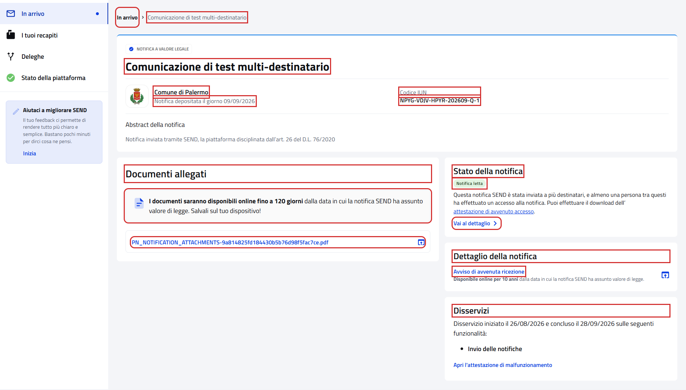
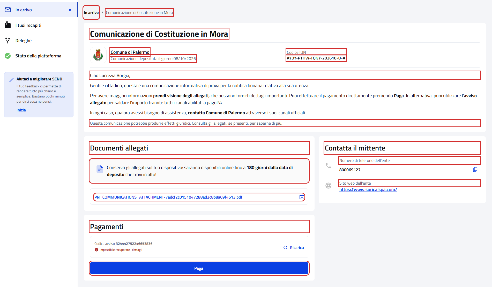
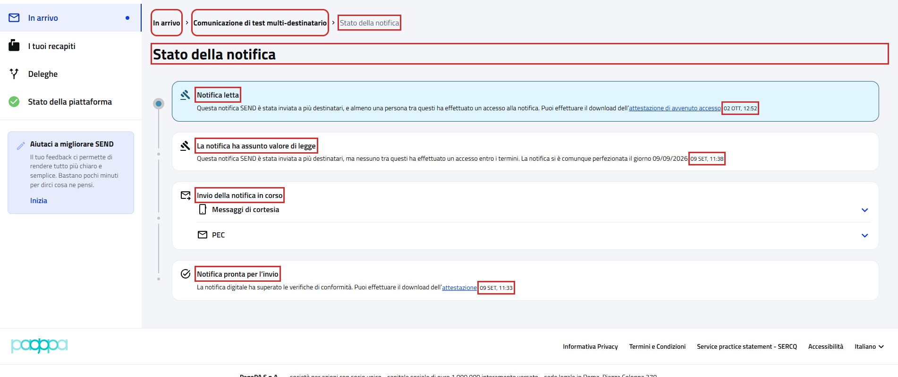

# Dettaglio notifica e Stato della notifica

Pagine aperte da "Apri" in "In arrivo":

- `{baseUrl}/notifiche/<IUN>/dettaglio` per una notifica a valore legale;
- `{baseUrl}/comunicazione/<IUN>/dettaglio` per una comunicazione;
- `{baseUrl}/notifiche/<IUN>/dettaglio/timeline`, "Stato della notifica", da "Vai al dettaglio" nel dettaglio.

Riferimenti:

- Page object: [`NotificationDetailsPFPage`](../../src/main/java/it/pagopa/send/web/destinatario_pf/infrastructure/page/NotificationDetailsPFPage.java)
  e [`NotificationTimelinePFPage`](../../src/main/java/it/pagopa/send/web/destinatario_pf/infrastructure/page/NotificationTimelinePFPage.java)
- Test: [`WebNotificationDetailsPFContractTest`](../../src/test/java/it/pagopa/send/suite/contract/destinatario_pf/WebNotificationDetailsPFContractTest.java)
- Utente: Lucrezia Borgia
- Navigazione: `WebRecipientPfNavigationContractTest#shouldReachNotificationDetailsPF` e
  `#shouldReachNotificationTimelinePF`, vedi
  [WebRecipientPfNavigationContractTest.md](WebRecipientPfNavigationContractTest.md#dettaglio-notifica)

## Le pagine

In rosso quello che controlla `assertLoaded()`: per il dettaglio l'oggetto, il breadcrumb e lo IUN; per la timeline il
titolo e il breadcrumb.

## Cosa verifica il contract test

Per la notifica a valore legale: intestazione, documenti, stato, avviso di avvenuta ricezione e disservizi. Per la
comunicazione: intestazione, messaggio, documenti, pagamenti e contatti del mittente. Per la timeline: titolo,
breadcrumb ed eventi. In rosso gli elementi controllati.

Notifica a valore legale (Lucrezia):

Comunicazione (Lucrezia):

Stato della notifica (Lucrezia):

## Note

- Il test apre solo notifiche già lette, cioè senza il pallino di "nuova": aprire una notifica a valore legale non letta
  la segna come letta e vale come presa visione. Se in prima pagina non ce n'è una della tipologia, lo scenario finisce
  senza aprirne.
- Il test non scarica documenti o attestazioni e non preme "Paga".
- Mittente, oggetto, IUN, stato ed eventi cambiano con la notifica: se ne controlla il formato. Avviso di avvenuta
  ricezione, disservizi, pagamenti e contatti si controllano se ci sono.
- "Paga" mostra l'importo quando il portale riesce a recuperarlo, ad esempio "Paga 120,00 €".
- Le date degli eventi sono nel formato "02 OTT, 12:52" e non tutti gli eventi ne hanno una.
- Nella timeline il breadcrumb dell'oggetto mostra "Dettaglio notifica" finché non arrivano i dati, quindi il test lo
  legge dopo gli eventi.
- Le sezioni che implementano `NotificationDetailsPage` sono condivise con gli step Cucumber e non sono state toccate:
  il test usa campi nuovi.
