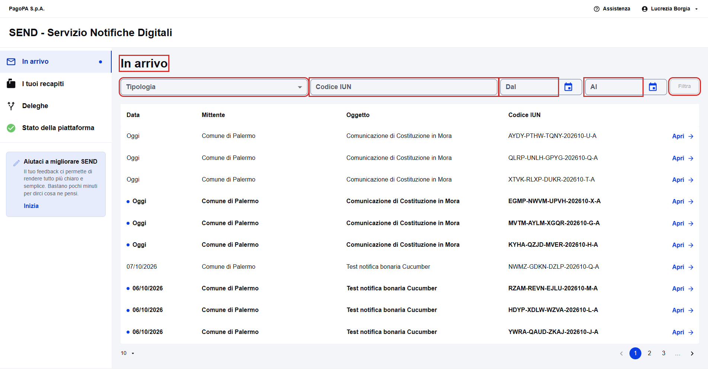
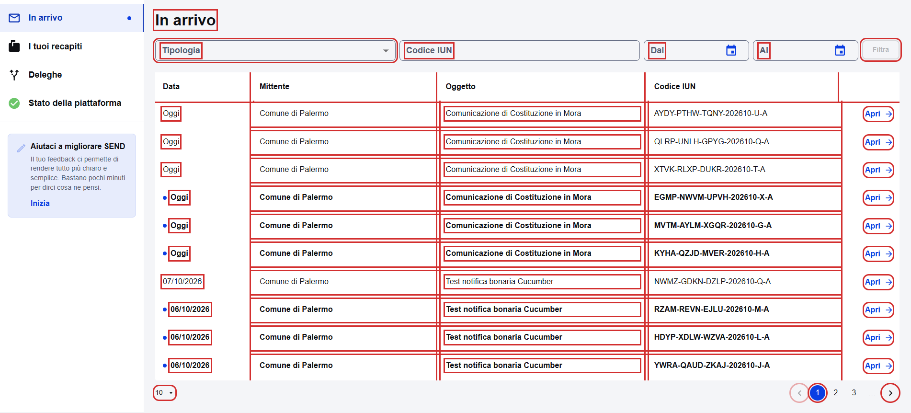
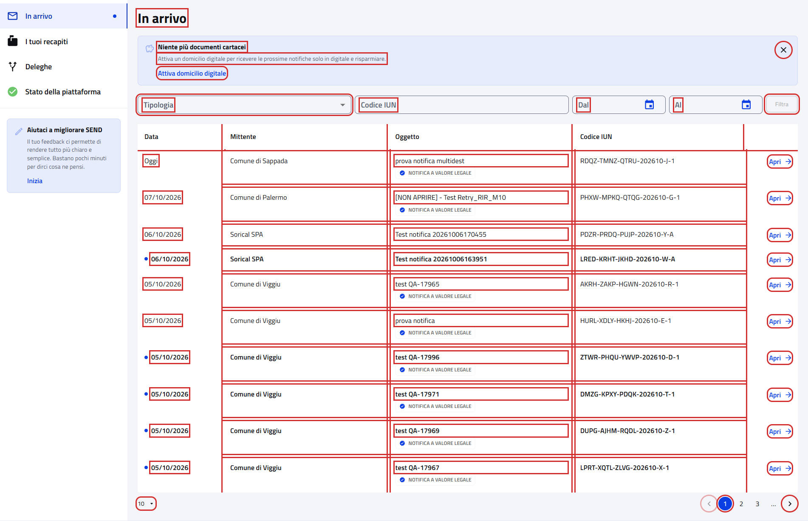

# In arrivo

Pagina `{baseUrl}/notifiche`: si apre dopo il login e dalla voce "In arrivo" del menu laterale.

- Page object: [`NotificationPFPage`](../../src/main/java/it/pagopa/send/web/destinatario_pf/infrastructure/page/NotificationPFPage.java),
  con gli elementi comuni all'impresa in [`RecipientNotificationsPage`](../../src/main/java/it/pagopa/send/web/notification_search/infrastructure/suit/RecipientNotificationsPage.java)
- Test: [`WebNotificationPFContractTest`](../../src/test/java/it/pagopa/send/suite/contract/destinatario_pf/WebNotificationPFContractTest.java),
  con gli scenari comuni in [`RecipientNotificationsScenarios`](../../src/test/java/it/pagopa/send/suite/contract/RecipientNotificationsScenarios.java)
- Utente: Lucrezia Borgia
- Navigazione: `WebRecipientPfNavigationContractTest#shouldReachNotificationListPF`, vedi
  [WebRecipientPfNavigationContractTest.md](WebRecipientPfNavigationContractTest.md#in-arrivo)

## La pagina

In rosso quello che controlla `assertLoaded()`: il titolo e i campi dei filtri. Lo usano anche gli step Cucumber.

## Cosa verifica il contract test

I testi della pagina e dei filtri, le opzioni di "Tipologia", la tabella con la paginazione, il filtro per tipologia,
il banner per attivare il domicilio digitale e i messaggi dei filtri. In rosso gli elementi controllati, esclusi i
messaggi e i menu aperti.

Con domicilio digitale (Lucrezia):

Senza domicilio digitale, con il banner:

## Tabella e filtri

- Colonne: Data, Mittente, Oggetto, Codice IUN e una senza titolo con "Apri".
- Data: "Oggi", "Ieri" o `gg/mm/aaaa`. IUN nel formato `XXXX-XXXX-XXXX-AAAAMM-X-X`.
- Paginazione: 10 righe, scelta tra 10, 20 e 50.
- Con "Notifiche a valore legale" ogni riga ha l'etichetta "Notifica a valore legale", con "Comunicazioni" nessuna.
- Messaggi: "Inserisci un codice IUN valido" con IUN `abc`; "Inserisci una data compresa tra … e …" con una data di più
  di 10 anni fa o futura. Il test calcola le due date dal giorno corrente.

## Note

- Il test non apre le notifiche, perché aprirle le segna come lette, e non chiude il banner.
- Il banner "Niente più documenti cartacei" compare solo a chi non ha un domicilio digitale; è stato provato
  l'08/10/2026 con un utente senza recapiti. Nessun utente di test è senza notifiche.
- Dopo "Filtra" la tabella si aggiorna con un po' di ritardo: il test rilegge le righe fino a 10 secondi.
- Selenium legge l'etichetta in maiuscolo ("NOTIFICA A VALORE LEGALE") per via dello stile, quindi il confronto ignora
  maiuscole e minuscole.
