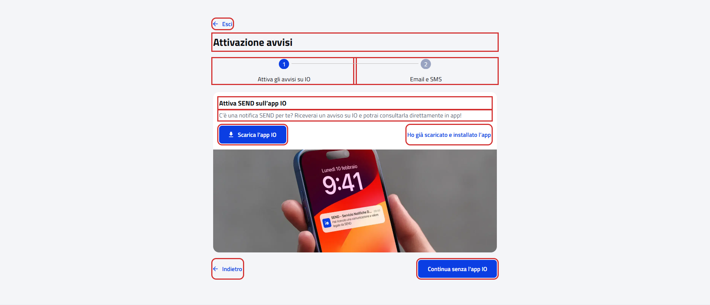
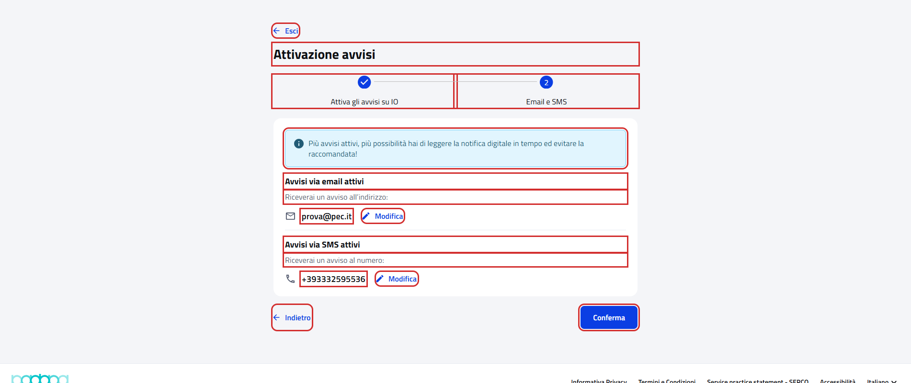
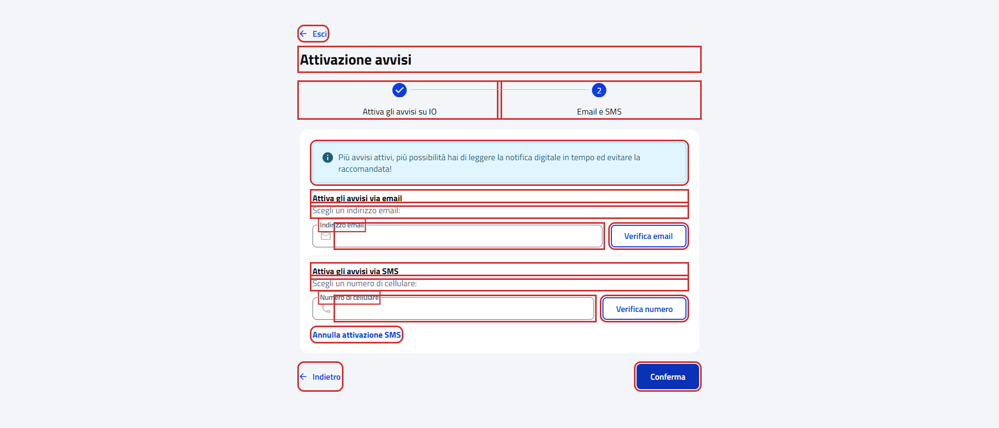

# WebOnboardingAlertsPFContractTest

Contract test del wizard di onboarding **"Attivazione avvisi"** del cittadino.

- **Indirizzo:** `{baseUrl}/onboarding/avvisi`, dalla card "Voglio solo gli avvisi" della pagina "Configura SEND"
  (`{baseUrl}/onboarding`)
- **Page Object:** [`OnboardingAlertsPFPage`](../../src/main/java/it/pagopa/send/web/destinatario_pf/infrastructure/page/OnboardingAlertsPFPage.java)
- **Test:** [`WebOnboardingAlertsPFContractTest`](../../src/test/java/it/pagopa/send/suite/contract/destinatario_pf/WebOnboardingAlertsPFContractTest.java)
- **Utente:** Lucrezia Borgia
- **Test di navigazione della pagina:** `WebRecipientPfNavigationContractTest#shouldReachOnboardingAlertsPF`, descritto
  in [WebRecipientPfNavigationContractTest.md](WebRecipientPfNavigationContractTest.md#onboarding-attivazione-avvisi)

## Cosa verifica

L'`assertLoaded()` della pagina verifica solo che sia caricata, e quello di ogni passo che il passo abbia un contenuto.
Questo contract test verifica i testi comuni a tutti i passi e, per ogni passo, testi e pulsanti.

Il wizard è una sola pagina con due passi: "Attiva gli avvisi su IO", mostrato all'apertura, ed "Email e SMS". Gli
scenari si spostano tra i passi con "Indietro" e "Avanti", che non salvano nulla. Nessuno scenario compila i campi,
preme "Verifica" o preme "Conferma" sull'ultimo passo.

## Il passo "Email e SMS" dipende dai recapiti dell'utente

Per l'email e per il cellulare il passo mostra un blocco diverso a seconda che il recapito di cortesia sia già attivo:

| Recapito | Già attivo (Lucrezia) | Da inserire (utente senza recapiti di cortesia) |
|---|---|---|
| Email | "Avvisi via email attivi", l'indirizzo e "Modifica" | "Attiva gli avvisi via email", il campo "Indirizzo email" vuoto e "Verifica email" |
| Cellulare | "Avvisi via SMS attivi", il numero e "Modifica" | "Attiva gli avvisi via SMS", il campo "Numero di cellulare" vuoto, "Verifica numero" e "Annulla attivazione SMS" |

Lo scenario del passo legge il contenuto del passo e verifica, per ciascun recapito, il blocco presente. Con Lucrezia
sono verificati i blocchi dei recapiti attivi; i blocchi da inserire sono stati eseguiti il 07/10/2026 con un utente
senza recapiti di cortesia.

I testi del blocco "Attiva SEND sull'app IO" del primo passo sono gli stessi della pagina "Tutto, sull'app IO" e del
wizard "Il meglio di SEND": sono costanti condivise in `OnboardingIoExpectedTexts`.

## Scenari

Negli screenshot dei passi: in rosso gli elementi che il contract test legge e verifica, esclusi i messaggi di validazione.

### Testi comuni a tutti i passi (`shouldShowAlertsWizardTexts`)

| Scenario | Cosa verifica |
|---|---|
| titolo, pulsante per uscire e nomi dei passi | titolo "Attivazione avvisi", "Esci" e i nomi dei due passi |

### Passo 1 (`shouldShowIoSection`)

| Scenario | Cosa verifica |
|---|---|
| passo attiva gli avvisi su IO | titolo e descrizione del blocco IO, "Scarica l'app IO", "Ho già scaricato e installato l'app", "Indietro" e "Continua senza l'app IO" |

### Passo 2 (`shouldShowEmailSmsSection`)

| Scenario | Cosa verifica |
|---|---|
| se raggiungibile, passo email e SMS con i blocchi dei recapiti attivi o da inserire | il banner "Più avvisi attivi…", per email e cellulare il blocco presente (vedi la tabella sopra), "Indietro" e "Conferma" (non premuto) |

Recapiti già attivi (Lucrezia):

Recapiti da inserire:

### Validazioni (`shouldValidateEmailSmsSection`)

Con un valore valido "Verifica" (recapito da inserire) e "Conferma" (modifica di un recapito attivo) avviano l'invio del
codice di verifica, quindi gli scenari usano solo valori non validi anche senza spazi (`abc`, `123`). I messaggi
compaiono dopo il clic sul pulsante, non uscendo dal campo. Ogni scenario si esegue solo se il blocco del recapito è nello
stato giusto: con Lucrezia le modifiche, con un utente senza recapiti di cortesia i recapiti da inserire.

Il portale tratta gli spazi in modo diverso nei due casi: nel campo per inserire un recapito gli spazi all'inizio o alla
fine danno errore, nel campo per modificarlo vengono tolti prima di validare.

| Scenario | Cosa verifica |
|---|---|
| se da inserire, email vuota | "Indirizzo email non valido" dopo "Verifica email" |
| se da inserire, email non valida | "Indirizzo email non valido" dopo "Verifica email" |
| se da inserire, email con spazi all'inizio o alla fine | "Elimina gli spazi all'inizio o alla fine" dopo "Verifica email" |
| se da inserire, cellulare vuoto | "Numero di cellulare non valido" dopo "Verifica numero" |
| se da inserire, cellulare non valido | "Numero di cellulare non valido" dopo "Verifica numero" |
| se da inserire, cellulare con spazi all'inizio o alla fine | "Elimina gli spazi all'inizio o alla fine" dopo "Verifica numero" |
| se attiva, modifica email vuota | "Indirizzo email non valido" dopo "Modifica" e "Conferma" |
| se attiva, modifica email non valida | "Indirizzo email non valido" dopo "Modifica" e "Conferma" |
| se attivo, modifica cellulare vuoto | "Numero di cellulare non valido" dopo "Modifica" e "Conferma" |
| se attivo, modifica cellulare non valido | "Numero di cellulare non valido" dopo "Modifica" e "Conferma" |
