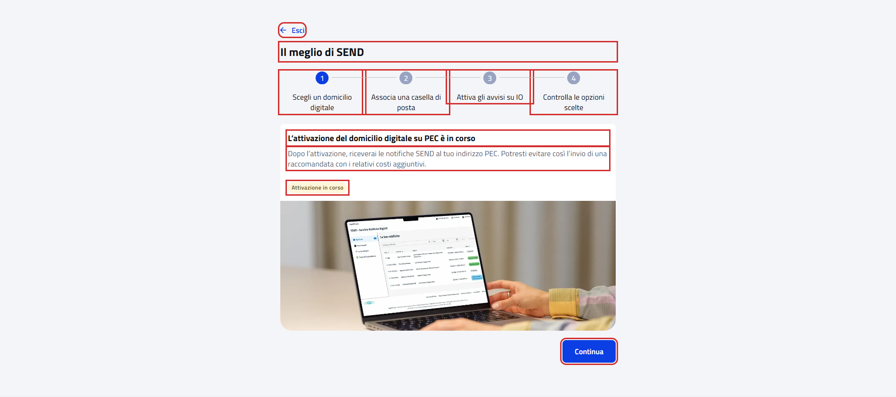
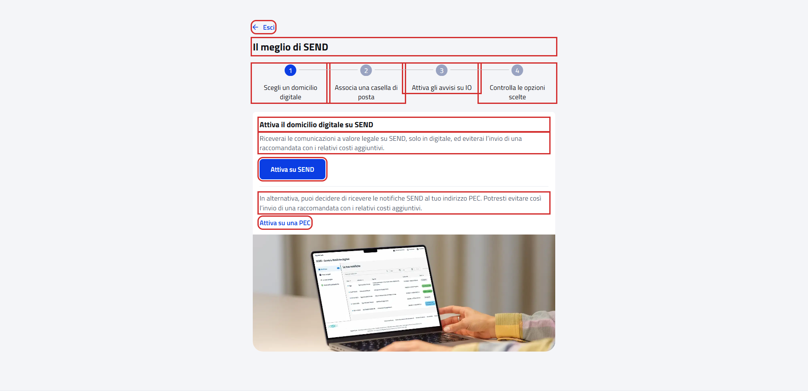
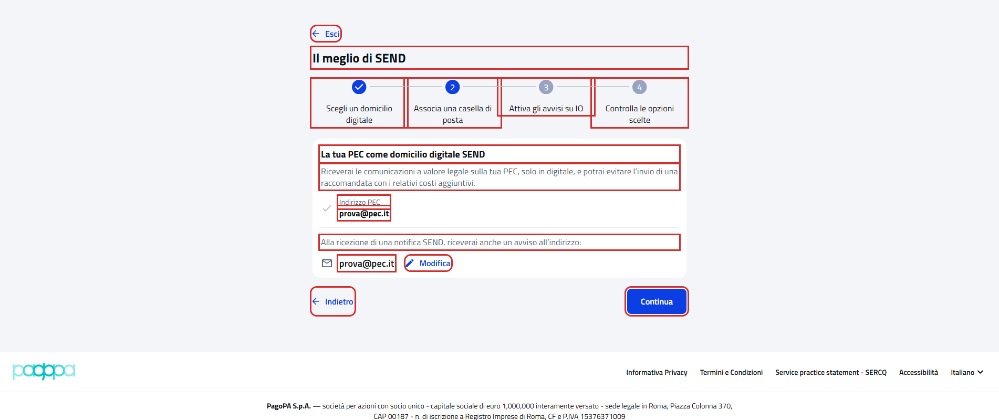
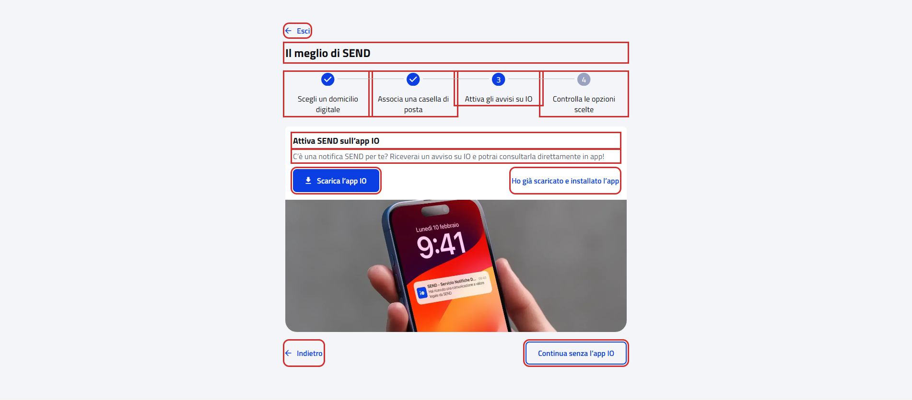
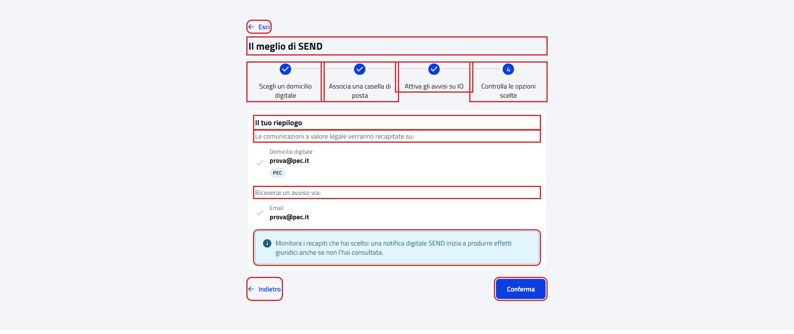

# WebOnboardingDigitalDomicilePFContractTest

Contract test del wizard di onboarding **"Il meglio di SEND"** del cittadino.

- **Indirizzo:** `{baseUrl}/onboarding/domicilio-digitale`, dalla card "Scelgo il meglio di SEND" della pagina
  "Configura SEND" (`{baseUrl}/onboarding`)
- **Page Object:** [`OnboardingDigitalDomicilePFPage`](../../src/main/java/it/pagopa/send/web/destinatario_pf/infrastructure/page/OnboardingDigitalDomicilePFPage.java)
- **Test:** [`WebOnboardingDigitalDomicilePFContractTest`](../../src/test/java/it/pagopa/send/suite/contract/destinatario_pf/WebOnboardingDigitalDomicilePFContractTest.java)
- **Utente:** Lucrezia Borgia
- **Test di navigazione della pagina:** `WebRecipientPfNavigationContractTest#shouldReachOnboardingDigitalDomicilePF`,
  descritto in [WebRecipientPfNavigationContractTest.md](WebRecipientPfNavigationContractTest.md#onboarding-il-meglio-di-send)

## Cosa verifica

L'`assertLoaded()` della pagina verifica solo che sia caricata, e quello di ogni passo che ci sia il titolo del passo.
Questo contract test verifica i testi comuni a tutti i passi e, per ogni passo, testi e pulsanti.

## I passi dipendono dai recapiti dell'utente

Il wizard è una sola pagina: i passi cambiano dentro la pagina e l'indirizzo resta lo stesso. Il passo mostrato
all'apertura e il contenuto dei passi dipendono dai recapiti dell'utente. Ogni scenario si sposta sul suo passo con
"Indietro" e "Avanti", che non salvano nulla, e lo verifica se è raggiungibile.

Nessuno scenario fa scelte nei passi o preme "Conferma" sull'ultimo passo.

| Passo | Lucrezia (PEC in attivazione) | Utente senza PEC |
|---|---|---|
| 1. Scegli un domicilio digitale | avviso "L'attivazione del domicilio digitale su PEC è in corso", raggiunto con "Indietro" | scelta tra "Attiva su SEND" e "Attiva su una PEC", passo di apertura |
| 2. Associa una casella di posta | la sua PEC e l'email per gli avvisi, passo di apertura | raggiungibile solo dopo una scelta al passo 1: non verificato |
| 3. Attiva gli avvisi su IO | blocco "Attiva SEND sull'app IO" | come sopra |
| 4. Controlla le opzioni scelte | riepilogo, con "Conferma" non premuto | come sopra |

Con Lucrezia sono verificati tutti i passi. La variante del passo 1 con la scelta tra SEND e PEC è stata eseguita il
07/10/2026 con un utente senza PEC: con lui i passi 2-4 non sono raggiungibili senza una scelta e gli scenari terminano
senza verificarli.

I testi del blocco "Attiva SEND sull'app IO" sono gli stessi della pagina "Tutto, sull'app IO" e del wizard
"Attivazione avvisi": sono costanti condivise in `OnboardingIoExpectedTexts`.

## Scenari

Negli screenshot dei passi: in rosso gli elementi che il contract test legge e verifica, esclusi i messaggi di validazione.

### Testi comuni a tutti i passi (`shouldShowDigitalDomicileWizardTexts`)

| Scenario | Cosa verifica |
|---|---|
| titolo, pulsante per uscire e nomi dei passi | titolo "Il meglio di SEND", "Esci" e i nomi dei quattro passi |

### Passo 1 (`shouldShowChooseDigitalDomicileSection`)

| Scenario | Cosa verifica |
|---|---|
| passo scegli un domicilio digitale: scelta tra SEND e PEC oppure PEC in attivazione | per un utente senza PEC: titolo, descrizioni e pulsanti "Attiva su SEND" e "Attiva su una PEC"; per un utente con PEC in attivazione: titolo, descrizione, etichetta "Attivazione in corso" e "Continua" |

Utente con PEC in attivazione (Lucrezia):

Utente senza PEC:

### Passo 2 (`shouldShowPecSection`)

| Scenario | Cosa verifica |
|---|---|
| se raggiungibile, passo associa una casella di posta con la PEC dell'utente | titolo, descrizione, etichetta "Indirizzo PEC" con la PEC, frase sugli avvisi con l'email, "Modifica", "Indietro" e "Continua" |

### Passo 3 (`shouldShowIoSection`)

| Scenario | Cosa verifica |
|---|---|
| se raggiungibile, passo attiva gli avvisi su IO | titolo e descrizione del blocco IO, "Scarica l'app IO", "Ho già scaricato e installato l'app", "Indietro" e "Continua senza l'app IO" |

### Passo 4 (`shouldShowSummarySection`)

| Scenario | Cosa verifica |
|---|---|
| se raggiungibile, passo riepilogo con conferma non premuta | titolo "Il tuo riepilogo", le due etichette del riepilogo, l'avviso "Monitora i recapiti che hai scelto…", "Indietro" e "Conferma" (non premuto) |

### Validazioni (`shouldValidatePecSectionEmail`)

"Modifica" sull'email del passo 2 apre un campo con l'email e "Conferma". Con un'email valida "Conferma" avvia l'invio
del codice di verifica al nuovo indirizzo, quindi gli scenari usano solo valori non validi, anche senza spazi: il portale
toglie gli spazi all'inizio e alla fine prima di validare.

| Scenario | Cosa verifica |
|---|---|
| se raggiungibile, modifica email vuota | "Indirizzo email non valido" dopo "Conferma" |
| se raggiungibile, modifica email non valida | "Indirizzo email non valido" dopo "Conferma" |
