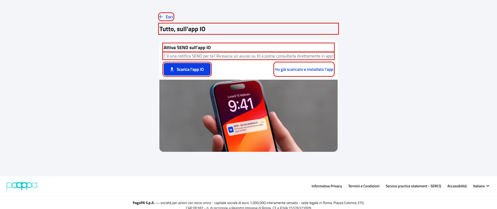

# Tutto, sull'app IO

Pagina di onboarding `{baseUrl}/onboarding/io`.

- Page object: [`OnboardingIoPFPage`](../../src/main/java/it/pagopa/send/web/destinatario_pf/infrastructure/page/OnboardingIoPFPage.java)
- Test: [`WebOnboardingIoPFContractTest`](../../src/test/java/it/pagopa/send/suite/contract/destinatario_pf/WebOnboardingIoPFContractTest.java)
- Utente: Lucrezia Borgia
- Navigazione: `WebRecipientPfNavigationContractTest#shouldReachOnboardingIoPF`, vedi
  [WebRecipientPfNavigationContractTest.md](WebRecipientPfNavigationContractTest.md#onboarding-tutto-sullapp-io)

## La pagina

In rosso quello che controlla `assertLoaded()`: il titolo e i pulsanti "Esci", "Scarica l'app IO" e "Ho già scaricato
e installato l'app".

## Cosa verifica il contract test

Il titolo, il titolo e la descrizione della sezione dell'app IO, il testo dei tre pulsanti e che "Esci" riporti a
"Configura SEND". In rosso gli elementi controllati.

## Da dove si arriva

Nel portale la pagina si apre solo dalla terza card di "Configura SEND", "Preferisco attivare solo SEND sull'app IO",
che compare solo a chi non ha recapiti di cortesia (email, SMS o app IO).

Il passaggio dalla card alla pagina lo controlla
[`WebConfigureAddressSendPFContractTest`](WebConfigureAddressSendPFContractTest.md). Questo test apre la pagina
dall'indirizzo, così funziona con qualunque utente.

## Note

- Il test non preme i pulsanti della sezione dell'app IO.
- I pulsanti "Indietro" e "Conferma" del wizard sono nella pagina ma nascosti, perché il wizard ha un solo passo: non
  sono mappati.
- Il blocco "Attiva SEND sull'app IO" compare anche come passo dei wizard "Il meglio di SEND" e "Attivazione avvisi",
  ma lì l'indirizzo resta quello del wizard.
