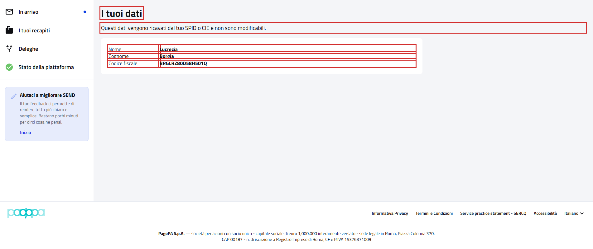

# WebProfilePFContractTest

Contract test della pagina **"I tuoi dati"** del cittadino.

- **Indirizzo:** `{baseUrl}/profilo`, dal menu dell'area utente in alto (pulsante con il nome dell'utente)
- **Page Object:** [`ProfilePFPage`](../../src/main/java/it/pagopa/send/web/destinatario_pf/infrastructure/page/ProfilePFPage.java)
- **Test:** [`WebProfilePFContractTest`](../../src/test/java/it/pagopa/send/suite/contract/destinatario_pf/WebProfilePFContractTest.java)
- **Utente:** Lucrezia Borgia
- **Test di navigazione della pagina:** `WebRecipientPfNavigationContractTest#shouldReachProfilePF`, descritto in
  [WebRecipientPfNavigationContractTest.md](WebRecipientPfNavigationContractTest.md#i-tuoi-dati)

## Cosa verifica

L'`assertLoaded()` della pagina verifica solo che sia caricata: che il titolo sia "I tuoi dati" e che ci siano le tre
righe dei dati. Questo contract test verifica:

- i **testi** della pagina e le etichette dei dati;
- i **dati dell'utente collegato**: nome, cognome e codice fiscale.

I dati sono ricavati da SPID o CIE e non sono modificabili: la pagina non ha form né pulsanti. I valori mostrati sono
confrontati con quelli dell'utente con cui si apre la pagina (`Recipient.LUCREZIA`: `denomination`, `familyName` e
`taxId`), quindi il test verifica anche che la pagina mostri i dati dell'utente giusto.

## Elementi verificati

In rosso gli elementi che il contract test legge e verifica, esclusi i messaggi di validazione.

## Scenari

### Testi della pagina (`shouldShowProfileTexts`)

| Scenario | Cosa verifica |
|---|---|
| intestazione della pagina | titolo "I tuoi dati" e sottotitolo |
| etichette dei dati | "Nome", "Cognome" e "Codice fiscale", nell'ordine |

### Dati dell'utente (`shouldShowProfileData`)

| Scenario | Cosa verifica |
|---|---|
| nome, cognome e codice fiscale dell'utente collegato | i tre valori sono quelli dell'utente collegato |
