# Test di navigazione delle pagine del portale SEND per le persone fisiche

Questo documento descrive `WebRecipientPfNavigationContractTest`: per ogni pagina del portale cittadini di SEND
verifica che la pagina si apra e che il suo `assertLoaded()` passi. Per ogni pagina riporta indirizzo, contenuto,
classe e test, lo screenshot e il rimando al suo `assertLoaded()`.

I contenuti di una pagina (testi, stato iniziale, validazioni dei campi) sono verificati invece dai contract test di
pagina, descritti ciascuno in un documento con lo stesso nome della classe di test:

- [`WebDelegationsPFContractTest`](WebDelegationsPFContractTest.md): pagina "Deleghe"
- [`WebNewDelegationPFContractTest`](WebNewDelegationPFContractTest.md): pagina "Aggiungi una delega"
- [`WebSupportPFContractTest`](WebSupportPFContractTest.md): pagina "Come possiamo aiutarti?" (assistenza)
- [`WebTermsOfServicePFContractTest`](WebTermsOfServicePFContractTest.md): pagina "Termini e condizioni d'uso"
- [`WebSercqTermsOfServicePFContractTest`](WebSercqTermsOfServicePFContractTest.md): pagina "Termini e condizioni d'uso" del domicilio digitale SERCQ
- [`WebConfigureAddressSendPFContractTest`](WebConfigureAddressSendPFContractTest.md): pagina di onboarding "Configura SEND"
- [`WebOnboardingIoPFContractTest`](WebOnboardingIoPFContractTest.md): pagina di onboarding "Tutto, sull'app IO"
- [`WebOnboardingDigitalDomicilePFContractTest`](WebOnboardingDigitalDomicilePFContractTest.md): wizard di onboarding "Il meglio di SEND"
- [`WebOnboardingAlertsPFContractTest`](WebOnboardingAlertsPFContractTest.md): wizard di onboarding "Attivazione avvisi"

Negli indirizzi `{baseUrl}` è la proprietà `url.notifiche.cittadino.base` del profilo attivo
(es. `https://cittadini.test.notifichedigitali.it` sul profilo `test`).

## Come leggere le pagine

L'`assertLoaded()` di ogni pagina verifica solo gli elementi **fissi**, presenti per qualunque utente: le parti che
dipendono dai dati dell'utente (recapiti configurati, deleghe, notifiche ricevute, disservizi) sono mappate come campi
o componenti ma non vengono verificate, per evitare test falliti per falsi positivi. Per le pagine che hanno un contract
test dedicato l'`assertLoaded()` verifica solo che la pagina sia caricata (titolo, input e pulsanti necessari):
testi e label sono verificati nel contract test.

Negli screenshot sono evidenziati con un **bordo rosso** gli elementi verificati dall'`assertLoaded()` della pagina (o
della sezione, per i passi dei wizard), ricavati dal codice dell'`assertLoaded()` stesso.

Gli screenshot sono catturati sull'ambiente `test` con l'utente di test Lucrezia Borgia, a 1920x1080, e vanno
rigenerati quando cambia l'`assertLoaded()` di una pagina. I dati visibili sono dati di test.

Screenshot aggiornati al: **07/10/2026**.

## Indice

- [In arrivo](#in-arrivo)
- [Dettaglio notifica](#dettaglio-notifica)
- [Stato della notifica (timeline)](#stato-della-notifica-timeline)
- [I tuoi recapiti](#i-tuoi-recapiti)
- [Attiva domicilio digitale su SEND](#attiva-domicilio-digitale-su-send)
- [Gestisci il tuo domicilio digitale](#gestisci-il-tuo-domicilio-digitale)
- [Deleghe](#deleghe)
- [Aggiungi una delega](#aggiungi-una-delega)
- [Configura SEND (onboarding)](#configura-send-onboarding)
- [Onboarding: Il meglio di SEND](#onboarding-il-meglio-di-send)
- [Onboarding: Attivazione avvisi](#onboarding-attivazione-avvisi)
- [Onboarding: Tutto, sull'app IO](#onboarding-tutto-sullapp-io)
- [Stato della piattaforma](#stato-della-piattaforma)
- [Assistenza](#assistenza)
- [I tuoi dati](#i-tuoi-dati)
- [Termini di servizio](#termini-di-servizio)
- [Termini di servizio SERCQ](#termini-di-servizio-sercq)

## In arrivo

**Indirizzo:** `{baseUrl}/notifiche`

Pagina "In arrivo" del cittadino, pagina iniziale del portale dopo il login. Si apre dalla voce "In arrivo" del menu laterale. Contiene i filtri di ricerca e la tabella delle notifiche ricevute. L'assertLoaded verifica solo gli elementi presenti per qualunque utente (titolo e filtri); il componente `NotificationsTable` mappa la tabella, che compare solo se l'utente ha ricevuto almeno una notifica.

- Page Object: [`NotificationPFPage`](../../src/main/java/it/pagopa/send/web/destinatario_pf/infrastructure/page/NotificationPFPage.java)
- Test: `WebRecipientPfNavigationContractTest#shouldReachNotificationListPF`

Elementi verificati: vedi `assertLoaded()` in [`NotificationPFPage`](../../src/main/java/it/pagopa/send/web/destinatario_pf/infrastructure/page/NotificationPFPage.java).

## Dettaglio notifica

**Indirizzo:** `{baseUrl}/notifiche/<IUN>/dettaglio`

Pagina di dettaglio di una notifica del cittadino. Si apre dal pulsante "Apri" di una riga della pagina `{baseUrl}/notifiche`. Il contenuto cambia con il tipo di notifica: una notifica a valore legale ha documenti, stato e disservizi, una comunicazione ha pagamenti e contatti del mittente. L'assertLoaded verifica solo gli elementi comuni a ogni notifica (breadcrumb, oggetto, mittente, data e IUN).

- Page Object: [`NotificationDetailsPFPage`](../../src/main/java/it/pagopa/send/web/destinatario_pf/infrastructure/page/NotificationDetailsPFPage.java)
- Test: `WebRecipientPfNavigationContractTest#shouldReachNotificationDetailsPF` (se presente: se l'utente non ha notifiche la pagina non è raggiungibile e il test termina senza verificare nulla)

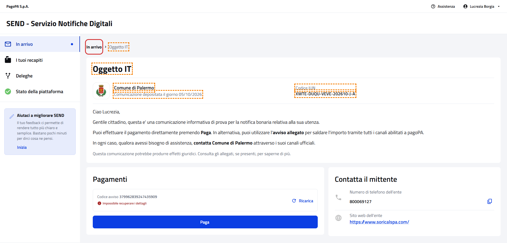

Elementi verificati: vedi `assertLoaded()` in [`NotificationDetailsPFPage`](../../src/main/java/it/pagopa/send/web/destinatario_pf/infrastructure/page/NotificationDetailsPFPage.java).

## Stato della notifica (timeline)

**Indirizzo:** `{baseUrl}/notifiche/<IUN>/dettaglio/timeline`

Pagina "Stato della notifica" del cittadino, con la timeline degli eventi di una notifica a valore legale. Si apre dal pulsante "Vai al dettaglio" della sezione "Stato della notifica" nel dettaglio della notifica. L'assertLoaded verifica gli elementi presenti per qualunque notifica; gli eventi cambiano da notifica a notifica, per cui di ciascuno si verifica solo che abbia un titolo e una data.

- Page Object: [`NotificationTimelinePFPage`](../../src/main/java/it/pagopa/send/web/destinatario_pf/infrastructure/page/NotificationTimelinePFPage.java)
- Test: `WebRecipientPfNavigationContractTest#shouldReachNotificationTimelinePF` (se presente: il test filtra la lista per notifiche a valore legale; se l'utente non ne ha la pagina non è raggiungibile e il test termina senza verificare nulla)

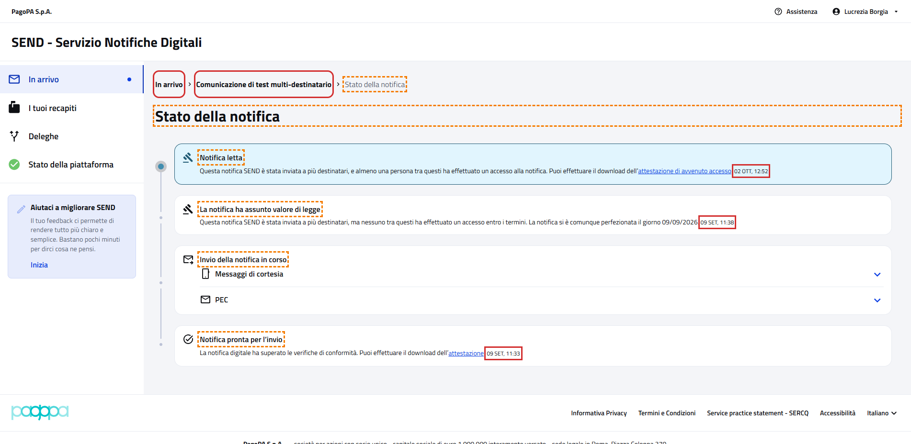

Elementi verificati: vedi `assertLoaded()` in [`NotificationTimelinePFPage`](../../src/main/java/it/pagopa/send/web/destinatario_pf/infrastructure/page/NotificationTimelinePFPage.java).

## I tuoi recapiti

**Indirizzo:** `{baseUrl}/recapiti`

Pagina "I tuoi recapiti" del cittadino. Si apre dalla voce "I tuoi recapiti" del menu laterale. Contiene le card del domicilio digitale, di SEND sull'app IO, dell'email e del cellulare. L'assertLoaded verifica solo gli elementi presenti per qualunque utente (titoli della pagina e delle card). I componenti `PecContact`, `SpecialContacts`, `EmailContact` e `SmsContact` mappano le sezioni che compaiono solo quando l'utente ha configurato il relativo recapito.

- Page Object: [`AddressPFPage`](../../src/main/java/it/pagopa/send/web/destinatario_pf/infrastructure/page/AddressPFPage.java)
- Test: `WebRecipientPfNavigationContractTest#shouldReachAddressPF`

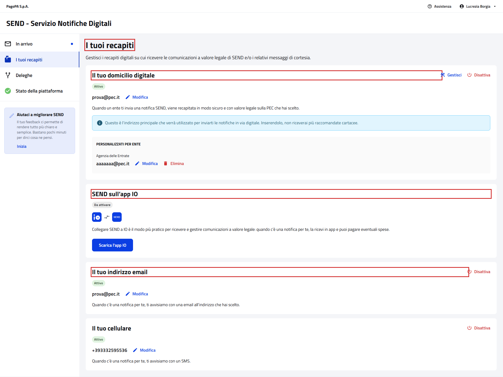

Elementi verificati: vedi `assertLoaded()` in [`AddressPFPage`](../../src/main/java/it/pagopa/send/web/destinatario_pf/infrastructure/page/AddressPFPage.java).

## Attiva domicilio digitale su SEND

**Indirizzo:** `{baseUrl}/recapiti/domicilio-digitale/attivazione`

Pagina del wizard "Attiva domicilio digitale su SEND" del cittadino. Si apre dalla card domicilio digitale di "I tuoi recapiti". Il wizard ha tre passi: "Come funziona" (mostrato all'apertura), "Inserisci la tua email" e "Riepilogo". L'assertLoaded verifica solo il primo passo. I componenti `EmailSection` e `SummarySection` mappano i passi successivi e verificano solo i loro elementi fissi: il contenuto (email, cellulare, contatti del riepilogo) dipende dai recapiti di cortesia già inseriti dall'utente. Il pulsante "Conferma" del riepilogo attiva il domicilio digitale.

- Page Object: [`DigitalDomicileActivationPFPage`](../../src/main/java/it/pagopa/send/web/destinatario_pf/infrastructure/page/DigitalDomicileActivationPFPage.java)
- Test: `WebRecipientPfNavigationContractTest#shouldReachDigitalDomicileActivationPF` (se presente: il test percorre il wizard fino al riepilogo senza mai premere Conferma e ne verifica gli elementi fissi; se l'utente non ha ancora un'email di cortesia il secondo passo chiede di inserirla e il test termina senza verificare il riepilogo)

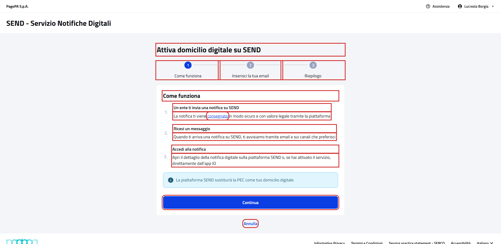

Passi del wizard: in ogni screenshot sono evidenziati gli elementi verificati dalla sezione di quel passo.

**Passo 2: Inserisci la tua email** (`EmailSection`)

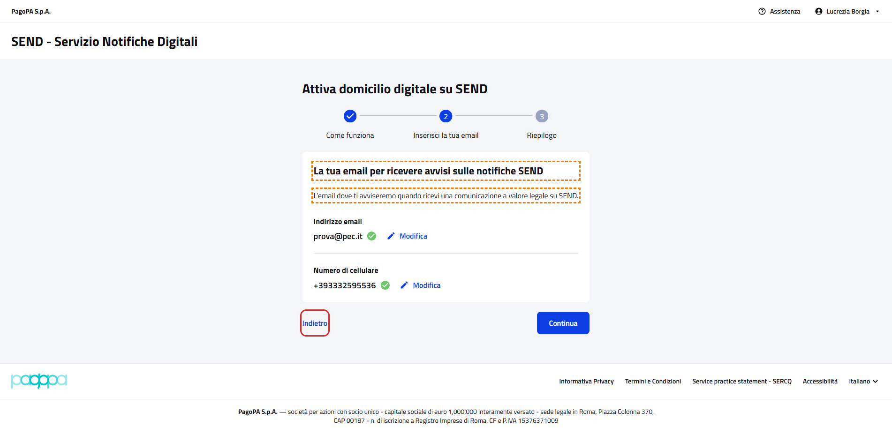

**Passo 3: Riepilogo (il pulsante Conferma non viene premuto)** (`SummarySection`)

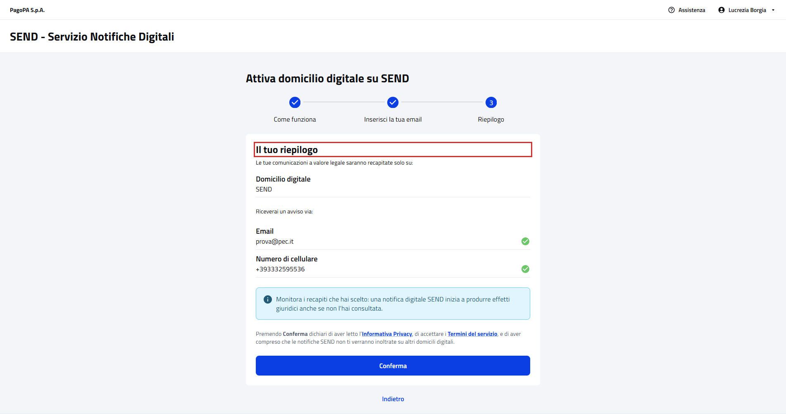

Elementi verificati: vedi `assertLoaded()` in [`DigitalDomicileActivationPFPage`](../../src/main/java/it/pagopa/send/web/destinatario_pf/infrastructure/page/DigitalDomicileActivationPFPage.java).

## Gestisci il tuo domicilio digitale

**Indirizzo:** `{baseUrl}/recapiti/domicilio-digitale/gestione`

Pagina "Gestisci il tuo domicilio digitale" del cittadino. Si apre dal pulsante "Gestisci" della card domicilio digitale in "I tuoi recapiti". Mostra il domicilio digitale attivo e le opzioni per modificarlo; la pagina è disponibile solo a un utente con un domicilio digitale attivo. L'assertLoaded verifica solo gli elementi presenti per qualunque domicilio; stato, indirizzo e "Trasferisci su SEND" dipendono dal tipo di domicilio (PEC o SEND) e non vengono verificati.

- Page Object: [`DigitalDomicileManagementPFPage`](../../src/main/java/it/pagopa/send/web/destinatario_pf/infrastructure/page/DigitalDomicileManagementPFPage.java)
- Test: `WebRecipientPfNavigationContractTest#shouldReachDigitalDomicileManagementPF` (se presente: se l'utente non ha un domicilio digitale attivo la pagina non è raggiungibile e il test termina senza verificare nulla)

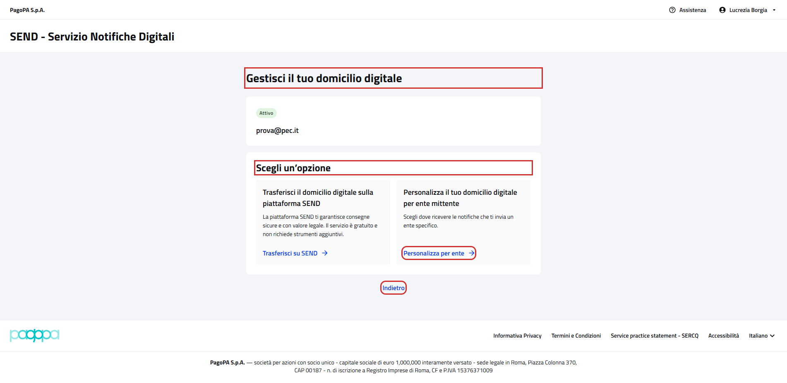

Elementi verificati: vedi `assertLoaded()` in [`DigitalDomicileManagementPFPage`](../../src/main/java/it/pagopa/send/web/destinatario_pf/infrastructure/page/DigitalDomicileManagementPFPage.java).

## Deleghe

**Indirizzo:** `{baseUrl}/deleghe`

Pagina "Deleghe" del cittadino. Si apre dalla voce "Deleghe" del menu laterale. Contiene la sezione "I tuoi delegati" (persone a cui l'utente ha delegato le proprie notifiche) e la sezione "Deleghe a tuo carico" (persone che hanno delegato l'utente). L'assertLoaded verifica che la pagina sia caricata, cioè il titolo, il pulsante "Aggiungi una delega" e le due sezioni; testi e contenuto delle sezioni, che dipende dalle deleghe dell'utente, sono verificati da `WebDelegationsPFContractTest`.

- Page Object: [`DelegationsPFPage`](../../src/main/java/it/pagopa/send/web/destinatario_pf/infrastructure/page/DelegationsPFPage.java)
- Test: `WebRecipientPfNavigationContractTest#shouldReachDelegationsPF`
- Contract test della pagina: [`WebDelegationsPFContractTest`](WebDelegationsPFContractTest.md)

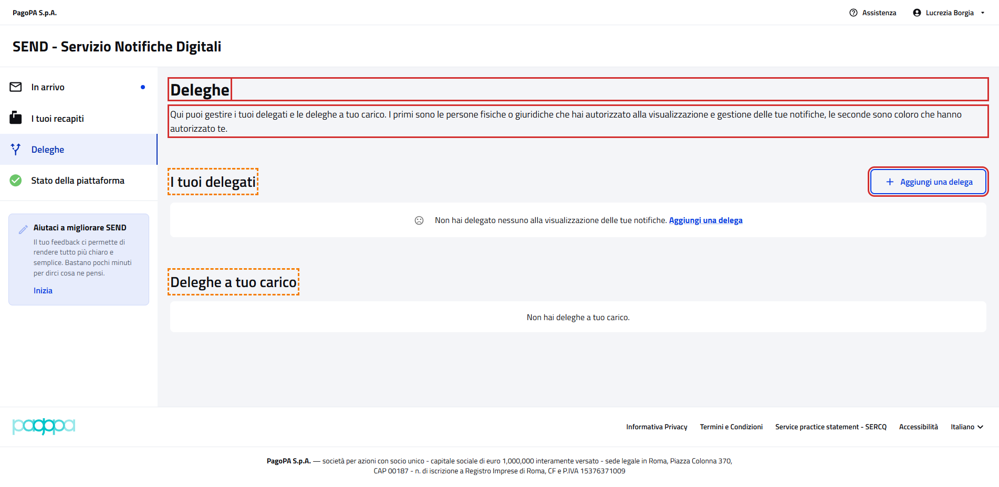

Elementi verificati: vedi `assertLoaded()` in [`DelegationsPFPage`](../../src/main/java/it/pagopa/send/web/destinatario_pf/infrastructure/page/DelegationsPFPage.java).

## Aggiungi una delega

**Indirizzo:** `{baseUrl}/deleghe/nuova`

Pagina "Aggiungi una delega" del cittadino. Si apre dal pulsante "Aggiungi una delega" della pagina `{baseUrl}/deleghe`. Contiene il form con i dati del delegato, gli enti, la scadenza e il codice di verifica da condividere con il delegato. L'assertLoaded verifica che la pagina sia caricata, cioè il titolo e la presenza degli input e dei pulsanti del form; testi, stato iniziale e validazioni del form sono verificati da `WebNewDelegationPFContractTest`.

- Page Object: [`NewDelegationPFPage`](../../src/main/java/it/pagopa/send/web/destinatario_pf/infrastructure/page/NewDelegationPFPage.java)
- Test: `WebRecipientPfNavigationContractTest#shouldReachNewDelegationPF`
- Contract test della pagina: [`WebNewDelegationPFContractTest`](WebNewDelegationPFContractTest.md)

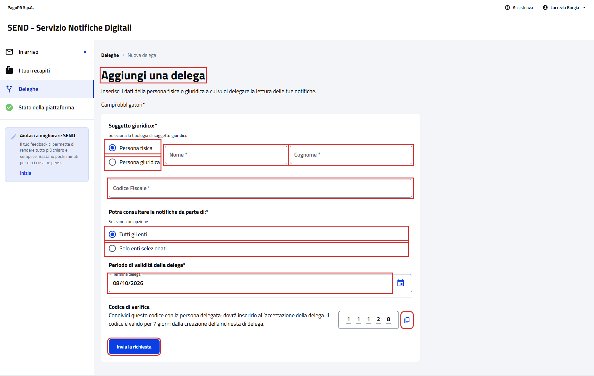

Elementi verificati: vedi `assertLoaded()` in [`NewDelegationPFPage`](../../src/main/java/it/pagopa/send/web/destinatario_pf/infrastructure/page/NewDelegationPFPage.java).

## Configura SEND (onboarding)

**Indirizzo:** `{baseUrl}/onboarding`

Pagina "Configura SEND" del cittadino (onboarding). Mostrata al primo accesso al portale. Contiene le card per scegliere come ricevere le notifiche, che aprono le pagine di onboarding, e il pulsante per saltare la configurazione. Le card "Scelgo il meglio di SEND" e "Voglio solo gli avvisi" sono mostrate a tutti; la terza card "Preferisco attivare solo SEND sull'app IO" solo agli utenti senza recapiti di cortesia (email, SMS o app IO). L'assertLoaded verifica che la pagina sia caricata, cioè il titolo e la presenza dei pulsanti delle due card mostrate a tutti e di "Salta"; testi e pagine aperte dalle card sono verificati da `WebConfigureAddressSendPFContractTest`.

- Page Object: [`ConfigureAddressSendPage`](../../src/main/java/it/pagopa/send/web/infrastructure/page/ConfigureAddressSendPage.java)
- Test: `WebRecipientPfNavigationContractTest#shouldReachOnboardingPF`
- Contract test della pagina: [`WebConfigureAddressSendPFContractTest`](WebConfigureAddressSendPFContractTest.md)

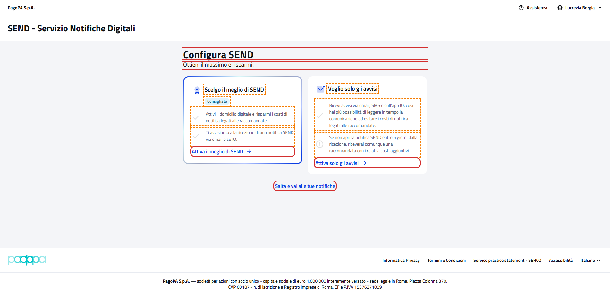

Elementi verificati: vedi `assertLoaded()` in [`ConfigureAddressSendPage`](../../src/main/java/it/pagopa/send/web/infrastructure/page/ConfigureAddressSendPage.java).

## Onboarding: Il meglio di SEND

**Indirizzo:** `{baseUrl}/onboarding/domicilio-digitale`

Pagina del wizard di onboarding "Il meglio di SEND" del cittadino. Si apre dalla card "Scelgo il meglio di SEND" della pagina `{baseUrl}/onboarding`. Il wizard ha quattro passi: scelta del domicilio digitale (`ChooseDigitalDomicileSection`), casella di posta (`PecSection` se l'utente ha già una PEC), avvisi su IO (`OnboardingWizardPFPage.IoSection`) e riepilogo (`SummarySection`). Il passo mostrato all'apertura dipende dai recapiti dell'utente. L'assertLoaded verifica che la pagina sia caricata, cioè il titolo "Il meglio di SEND", "Esci" e i quattro passi dell'indicatore; l'assertLoaded di ogni sezione verifica che il titolo del passo ci sia. I testi di ogni passo sono verificati da `WebOnboardingDigitalDomicilePFContractTest`.

- Page Object: [`OnboardingDigitalDomicilePFPage`](../../src/main/java/it/pagopa/send/web/destinatario_pf/infrastructure/page/OnboardingDigitalDomicilePFPage.java)
- Test: `WebRecipientPfNavigationContractTest#shouldReachOnboardingDigitalDomicilePF` (se presente: il test verifica il passo di apertura e ogni passo raggiunto con il pulsante avanti, fermandosi sull'ultimo senza premere Conferma; con un utente senza PEC si ferma al passo di scelta del domicilio, dopo averlo verificato)
- Contract test della pagina: [`WebOnboardingDigitalDomicilePFContractTest`](WebOnboardingDigitalDomicilePFContractTest.md)

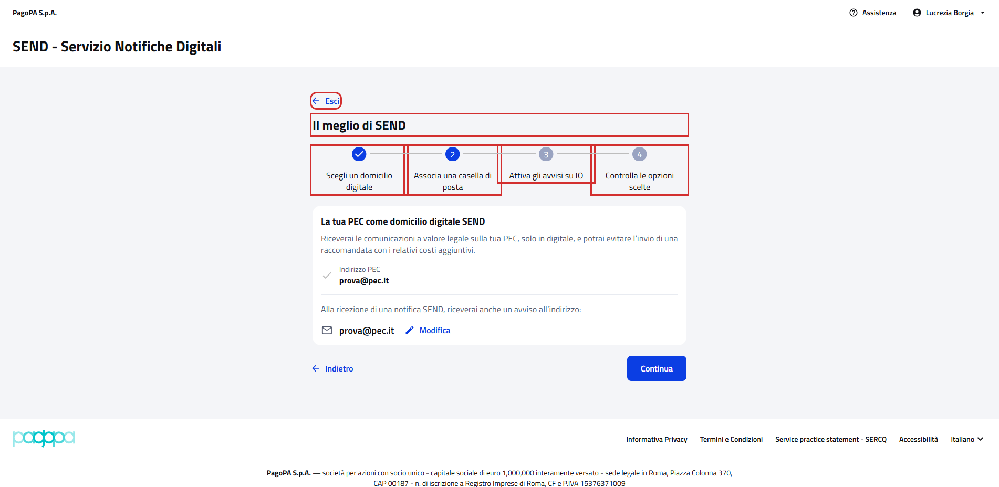

Passi del wizard: in ogni screenshot sono evidenziati gli elementi verificati dalla sezione di quel passo.

**Passo 1: Scegli un domicilio digitale (utente con PEC in attivazione, raggiunto con "Indietro")** (`ChooseDigitalDomicileSection`)

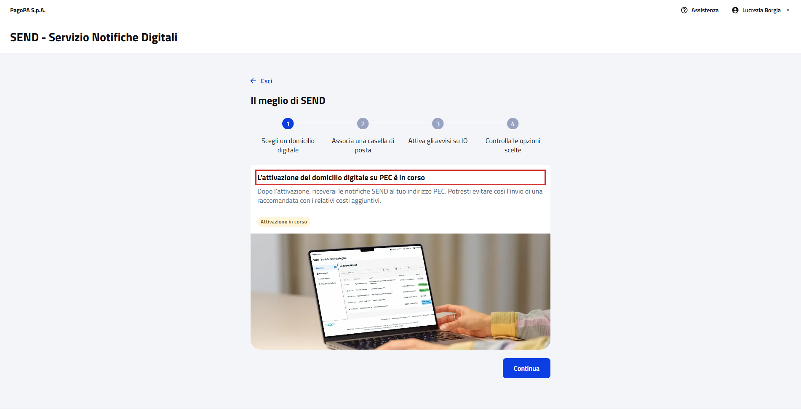

**Passo 2: Associa una casella di posta (utente con PEC)** (`PecSection`)

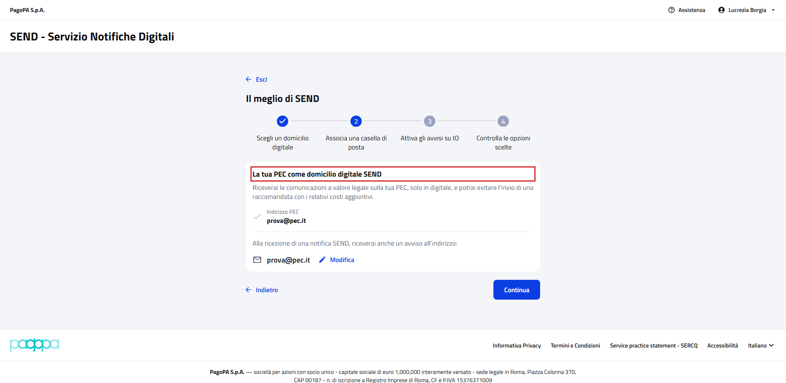

**Passo 3: Attiva gli avvisi su IO** (`IoSection`)

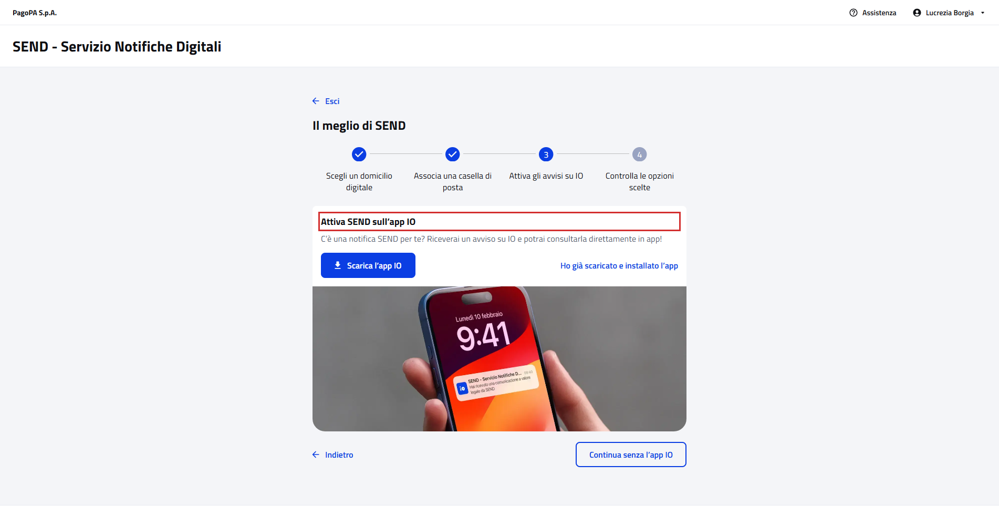

**Passo 4: Controlla le opzioni scelte (il pulsante Conferma non viene premuto)** (`SummarySection`)

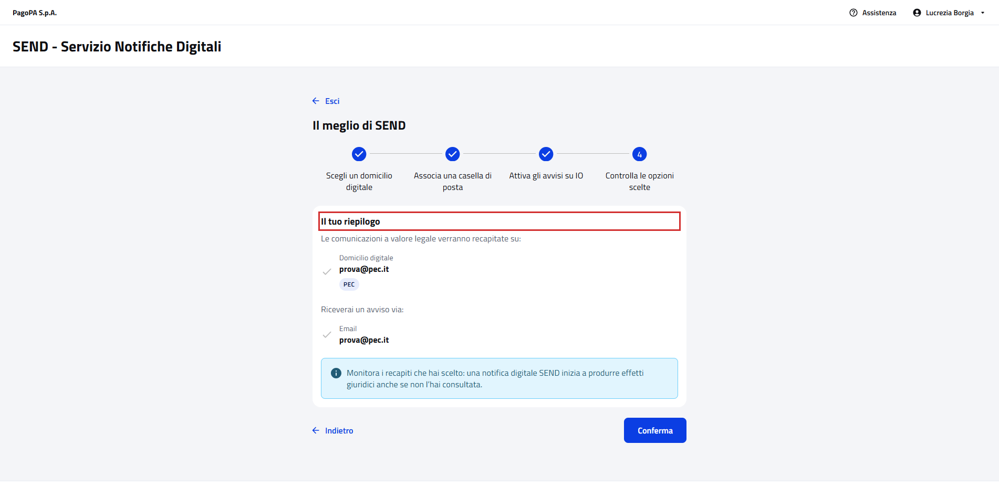

Elementi verificati: vedi `assertLoaded()` in [`OnboardingDigitalDomicilePFPage`](../../src/main/java/it/pagopa/send/web/destinatario_pf/infrastructure/page/OnboardingDigitalDomicilePFPage.java).

## Onboarding: Attivazione avvisi

**Indirizzo:** `{baseUrl}/onboarding/avvisi`

Pagina del wizard di onboarding "Attivazione avvisi" del cittadino. Si apre dalla card "Voglio solo gli avvisi" della pagina `{baseUrl}/onboarding`. Il wizard ha due passi: avvisi su IO (`OnboardingWizardPFPage.IoSection`) e avvisi via email e SMS (`EmailSmsSection`), il cui contenuto dipende dai recapiti di cortesia dell'utente. L'assertLoaded verifica che la pagina sia caricata, cioè il titolo "Attivazione avvisi", "Esci" e i due passi dell'indicatore; l'assertLoaded di ogni sezione verifica che il passo abbia un contenuto. I testi di ogni passo sono verificati da `WebOnboardingAlertsPFContractTest`.

- Page Object: [`OnboardingAlertsPFPage`](../../src/main/java/it/pagopa/send/web/destinatario_pf/infrastructure/page/OnboardingAlertsPFPage.java)
- Test: `WebRecipientPfNavigationContractTest#shouldReachOnboardingAlertsPF` (se presente: il test verifica il passo di apertura e ogni passo raggiunto con il pulsante avanti, fermandosi sull'ultimo senza premere Conferma)
- Contract test della pagina: [`WebOnboardingAlertsPFContractTest`](WebOnboardingAlertsPFContractTest.md)

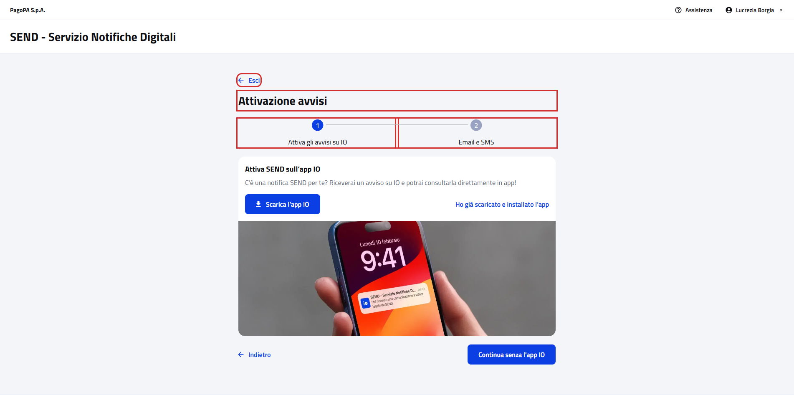

Passi del wizard: in ogni screenshot sono evidenziati gli elementi verificati dalla sezione di quel passo.

**Passo 1: Attiva gli avvisi su IO** (`IoSection`)

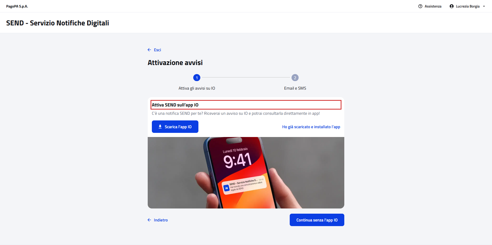

**Passo 2: Email e SMS (il pulsante Conferma non viene premuto)** (`EmailSmsSection`)

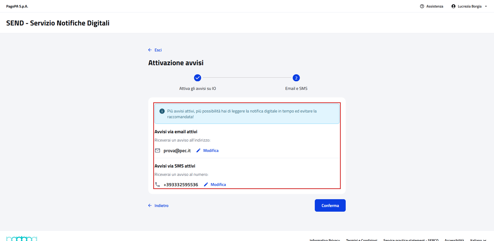

Elementi verificati: vedi `assertLoaded()` in [`OnboardingAlertsPFPage`](../../src/main/java/it/pagopa/send/web/destinatario_pf/infrastructure/page/OnboardingAlertsPFPage.java).

## Onboarding: Tutto, sull'app IO

**Indirizzo:** `{baseUrl}/onboarding/io`

Pagina di onboarding "Tutto, sull'app IO" del cittadino. Dal portale si apre solo dalla terza card "Preferisco attivare solo SEND sull'app IO" della pagina "Configura SEND" (`{baseUrl}/onboarding`), mostrata solo agli utenti senza recapiti di cortesia (email, SMS o app IO); il test di navigazione la apre dall'indirizzo. Non va confusa con il passo "Attiva gli avvisi su IO" dei wizard di onboarding, che mostra lo stesso blocco ma resta sull'indirizzo del wizard. L'assertLoaded verifica che la pagina sia caricata, cioè che il titolo sia "Tutto, sull'app IO" e che ci siano i pulsanti; testi e comportamento di "Esci" sono verificati da `WebOnboardingIoPFContractTest`.

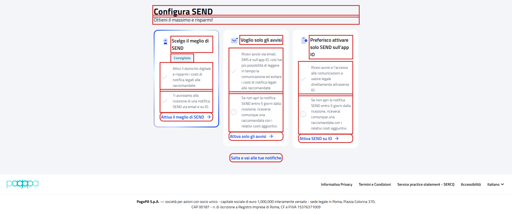

- Page Object: [`OnboardingIoPFPage`](../../src/main/java/it/pagopa/send/web/destinatario_pf/infrastructure/page/OnboardingIoPFPage.java)
- Test: `WebRecipientPfNavigationContractTest#shouldReachOnboardingIoPF`
- Contract test della pagina: [`WebOnboardingIoPFContractTest`](WebOnboardingIoPFContractTest.md)

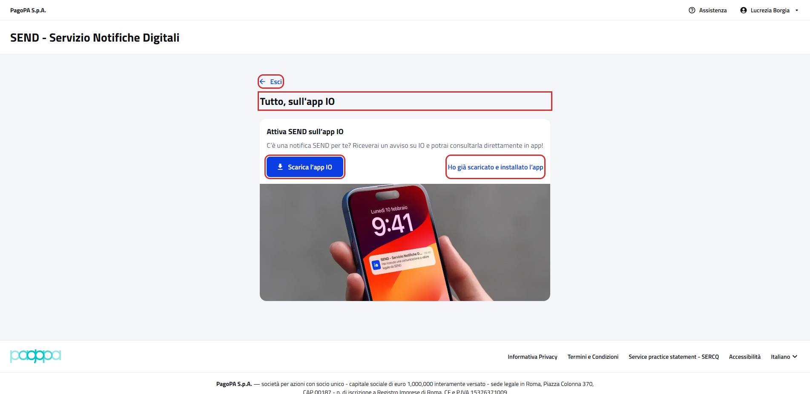

Elementi verificati: vedi `assertLoaded()` in [`OnboardingIoPFPage`](../../src/main/java/it/pagopa/send/web/destinatario_pf/infrastructure/page/OnboardingIoPFPage.java).

## Stato della piattaforma

**Indirizzo:** `{baseUrl}/app-status`

Pagina "Stato della piattaforma" del cittadino. Si apre dalla voce "Stato della piattaforma" del menu laterale. Contiene lo stato attuale dei servizi SEND e lo storico dei disservizi con le attestazioni scaricabili. L'assertLoaded verifica solo gli elementi sempre presenti; tabella e paginazione dello storico compaiono solo se la piattaforma ha registrato almeno un disservizio e non vengono verificate.

- Page Object: [`AppStatusPFPage`](../../src/main/java/it/pagopa/send/web/destinatario_pf/infrastructure/page/AppStatusPFPage.java)
- Test: `WebRecipientPfNavigationContractTest#shouldReachAppStatusPF`

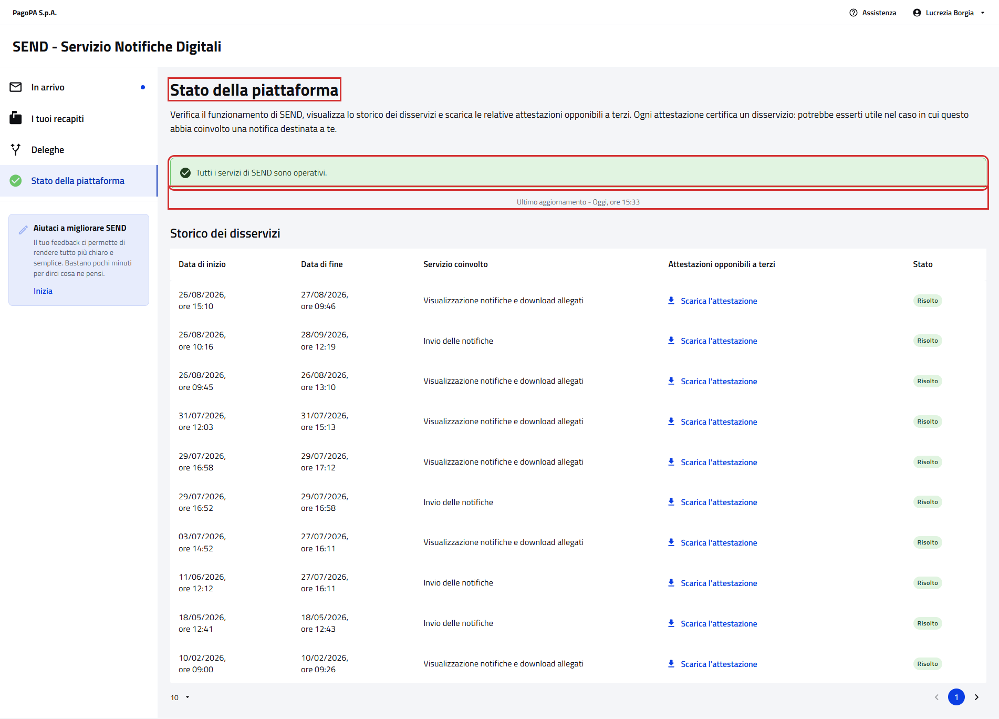

Elementi verificati: vedi `assertLoaded()` in [`AppStatusPFPage`](../../src/main/java/it/pagopa/send/web/destinatario_pf/infrastructure/page/AppStatusPFPage.java).

## Assistenza

**Indirizzo:** `{baseUrl}/assistenza`

Pagina "Come possiamo aiutarti?" del cittadino. Si apre dal link "Assistenza" (icona con il punto interrogativo) in alto nella pagina. Contiene il form per indicare l'email su cui ricevere le risposte dell'assistenza; "Avanti" resta disabilitato finché le due email non sono valide e uguali. L'assertLoaded verifica che la pagina sia caricata, cioè il titolo e la presenza dei campi e dei pulsanti del form; testi, stato iniziale e validazioni del form sono verificati da `WebSupportPFContractTest`.

- Page Object: [`SupportPFPage`](../../src/main/java/it/pagopa/send/web/destinatario_pf/infrastructure/page/SupportPFPage.java)
- Test: `WebRecipientPfNavigationContractTest#shouldReachSupportPF`
- Contract test della pagina: [`WebSupportPFContractTest`](WebSupportPFContractTest.md)

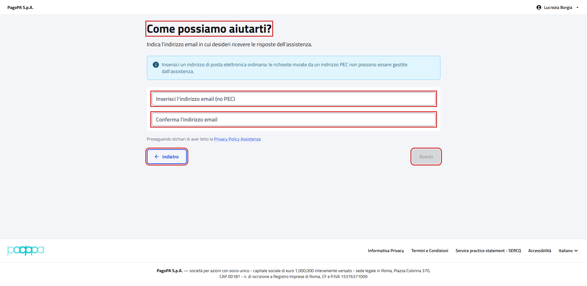

Elementi verificati: vedi `assertLoaded()` in [`SupportPFPage`](../../src/main/java/it/pagopa/send/web/destinatario_pf/infrastructure/page/SupportPFPage.java).

## I tuoi dati

**Indirizzo:** `{baseUrl}/profilo`

Pagina "I tuoi dati" del cittadino. Si apre dal menu dell'area utente in alto (pulsante con il nome dell'utente). Mostra nome, cognome e codice fiscale ricavati da SPID o CIE, non modificabili. L'assertLoaded verifica le etichette e che i valori siano presenti, senza controllare quelli di un utente specifico.

- Page Object: [`ProfilePFPage`](../../src/main/java/it/pagopa/send/web/destinatario_pf/infrastructure/page/ProfilePFPage.java)
- Test: `WebRecipientPfNavigationContractTest#shouldReachProfilePF`

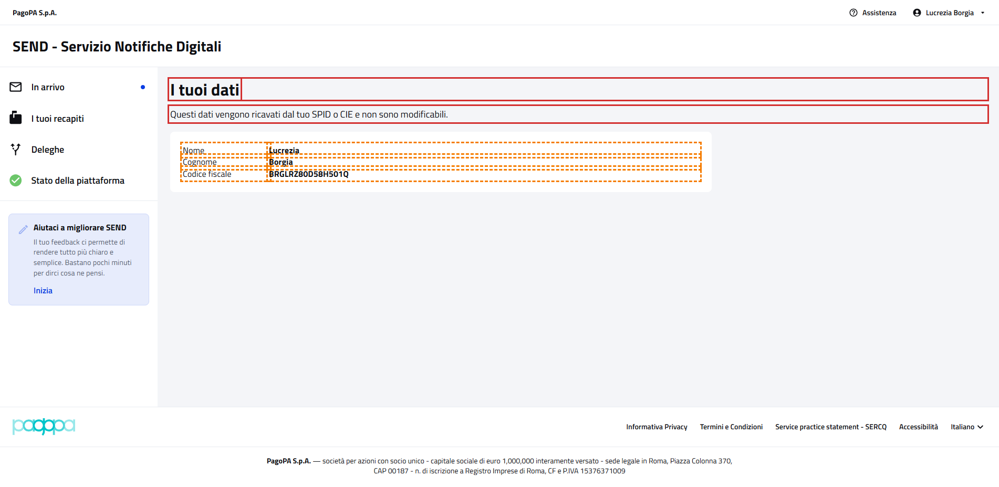

Elementi verificati: vedi `assertLoaded()` in [`ProfilePFPage`](../../src/main/java/it/pagopa/send/web/destinatario_pf/infrastructure/page/ProfilePFPage.java).

## Termini di servizio

**Indirizzo:** `{baseUrl}/termini-di-servizio`

Pagina dei termini e condizioni d'uso di SEND. Si apre dal link "Termini e Condizioni" nel footer del portale. Il testo è caricato da un widget OneTrust: un indice con un link per ogni sezione e le sezioni del documento. L'assertLoaded verifica che la pagina sia caricata, cioè che il titolo sia "Termini e condizioni d'uso" e che ci sia almeno una sezione; titoli delle sezioni e indice sono verificati da `WebTermsOfServicePFContractTest`.

- Page Object: [`TermsOfServicePFPage`](../../src/main/java/it/pagopa/send/web/destinatario_pf/infrastructure/page/TermsOfServicePFPage.java)
- Test: `WebRecipientPfNavigationContractTest#shouldReachTermsOfServicePF`
- Contract test della pagina: [`WebTermsOfServicePFContractTest`](WebTermsOfServicePFContractTest.md)

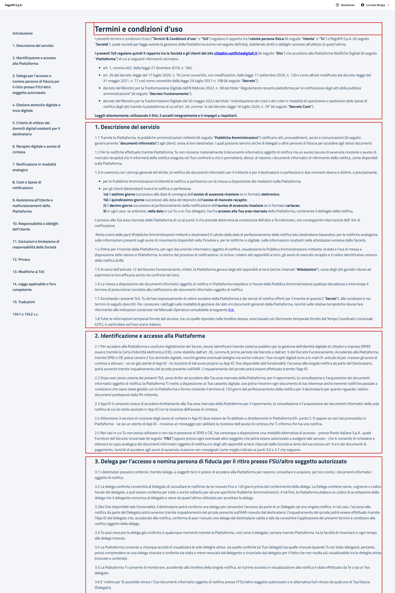

Elementi verificati: vedi `assertLoaded()` in [`TermsOfServicePFPage`](../../src/main/java/it/pagopa/send/web/destinatario_pf/infrastructure/page/TermsOfServicePFPage.java).

## Termini di servizio SERCQ

**Indirizzo:** `{baseUrl}/termini-di-servizio/sercq-send`

Pagina dei termini e condizioni d'uso del domicilio digitale SERCQ di SEND. Si apre dal link "Termini del servizio" nel riepilogo del wizard di attivazione del domicilio digitale. Il testo è caricato da un widget OneTrust: un indice con un link per ogni sezione e le sezioni del documento. L'assertLoaded verifica che la pagina sia caricata, cioè che il titolo sia "Termini e condizioni d'uso" e che ci sia almeno una sezione; titoli delle sezioni e indice sono verificati da `WebSercqTermsOfServicePFContractTest`.

- Page Object: [`SercqTermsOfServicePFPage`](../../src/main/java/it/pagopa/send/web/destinatario_pf/infrastructure/page/SercqTermsOfServicePFPage.java)
- Test: `WebRecipientPfNavigationContractTest#shouldReachSercqTermsOfServicePF`
- Contract test della pagina: [`WebSercqTermsOfServicePFContractTest`](WebSercqTermsOfServicePFContractTest.md)

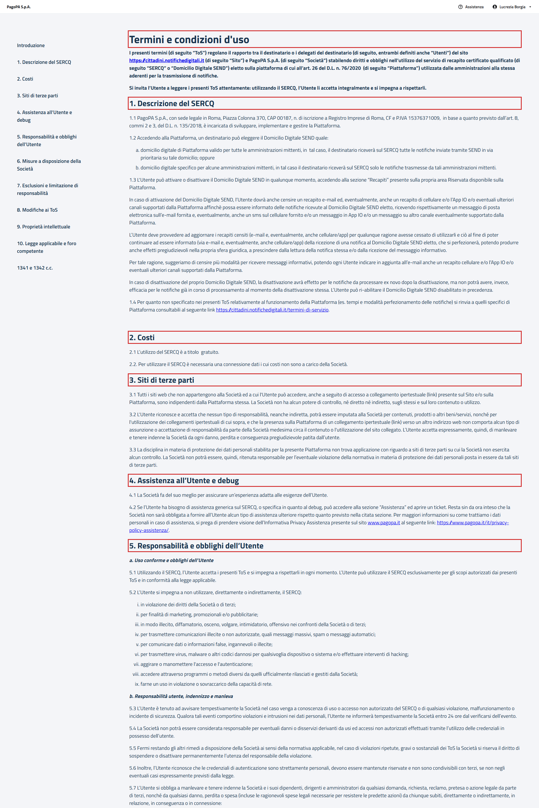

Elementi verificati: vedi `assertLoaded()` in [`SercqTermsOfServicePFPage`](../../src/main/java/it/pagopa/send/web/destinatario_pf/infrastructure/page/SercqTermsOfServicePFPage.java).
