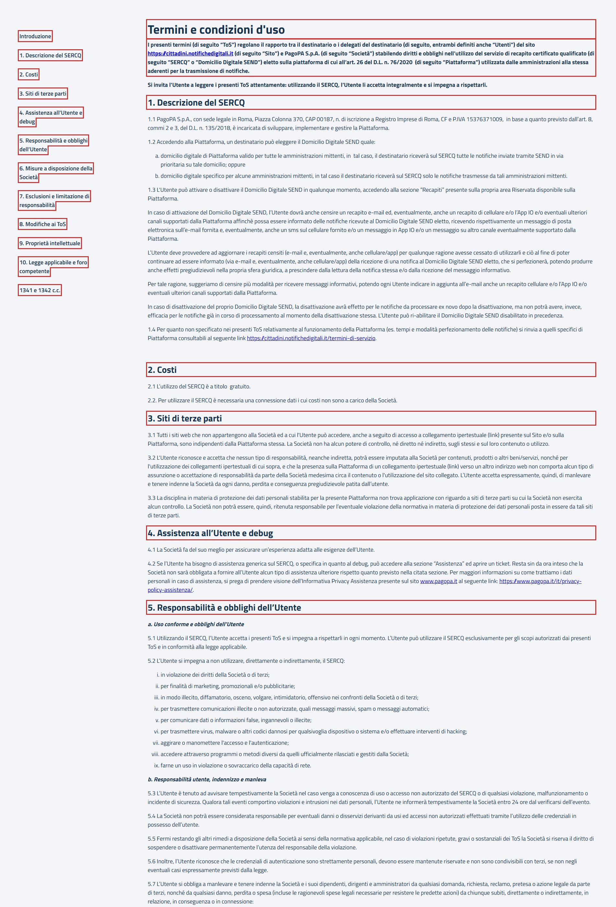

# WebSercqTermsOfServicePFContractTest

Contract test della pagina **"Termini e condizioni d'uso"** del domicilio digitale SERCQ di SEND.

- **Indirizzo:** `{baseUrl}/termini-di-servizio/sercq-send`, dal link "Termini del servizio" nel riepilogo del wizard di attivazione del domicilio digitale
- **Page Object:** [`SercqTermsOfServicePFPage`](../../src/main/java/it/pagopa/send/web/destinatario_pf/infrastructure/page/SercqTermsOfServicePFPage.java)
- **Test:** [`WebSercqTermsOfServicePFContractTest`](../../src/test/java/it/pagopa/send/suite/contract/destinatario_pf/WebSercqTermsOfServicePFContractTest.java)
- **Utente:** Lucrezia Borgia (la pagina è la stessa per qualunque cittadino)
- **Test di navigazione della pagina:** `WebRecipientPfNavigationContractTest#shouldReachSercqTermsOfServicePF`, descritto in
  [WebRecipientPfNavigationContractTest.md](WebRecipientPfNavigationContractTest.md#termini-di-servizio-sercq)

## Cosa verifica

L'`assertLoaded()` della pagina verifica solo che sia caricata: che il titolo sia "Termini e condizioni d'uso" e che ci
sia almeno una sezione. Questo contract test verifica:

- i **testi**: titolo, inizio dell'introduzione e titoli delle sezioni;
- l'**indice**: le voci e il collegamento di ognuna a una sezione della pagina.

Il testo è un documento legale caricato da un widget OneTrust. I titoli delle sezioni sono confrontati esattamente: se
il documento cambia il test fallisce e va aggiornato insieme al documento.

La pagina contiene due indici: uno per desktop e uno per mobile, nascosto. Il test usa quello per desktop.

## Elementi verificati

In rosso gli elementi che il contract test legge e verifica, esclusi i messaggi di validazione.

## Scenari

### Testi della pagina (`shouldShowSercqTermsOfServiceTexts`)

| Scenario | Cosa verifica |
|---|---|
| titolo e introduzione | titolo "Termini e condizioni d'uso" e inizio del primo paragrafo |
| titoli delle sezioni | i titoli delle 10 sezioni numerate, nell'ordine |

### Indice delle sezioni (`shouldShowSercqTermsOfServiceIndex`)

| Scenario | Cosa verifica |
|---|---|
| voci dell'indice | "Introduzione", le 10 sezioni numerate e "1341 e 1342 c.c.", nell'ordine |
| ogni voce dell'indice porta a una sezione della pagina | una voce per ogni sezione, ciascuna con un link a una sezione della pagina (`#otnotice-section-…`) |
