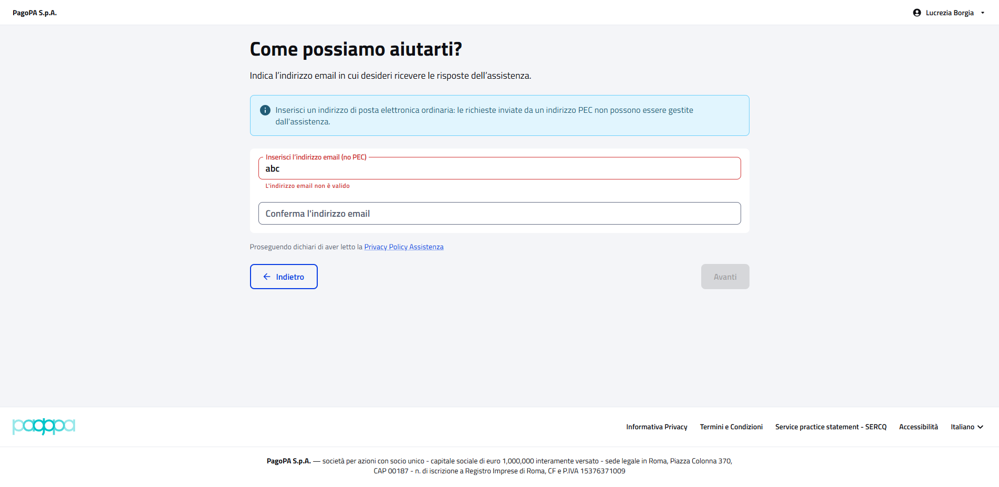
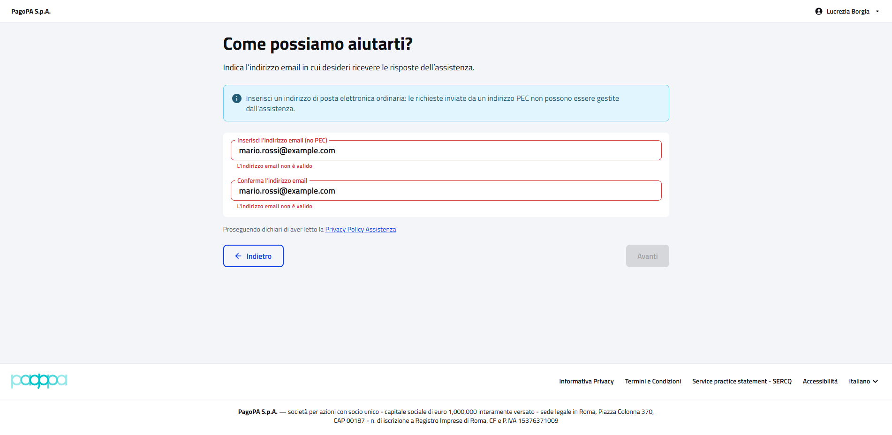
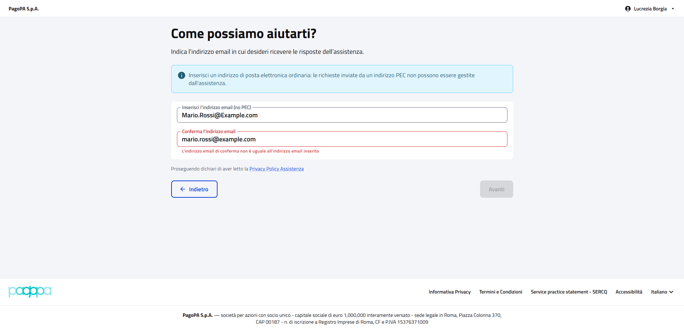
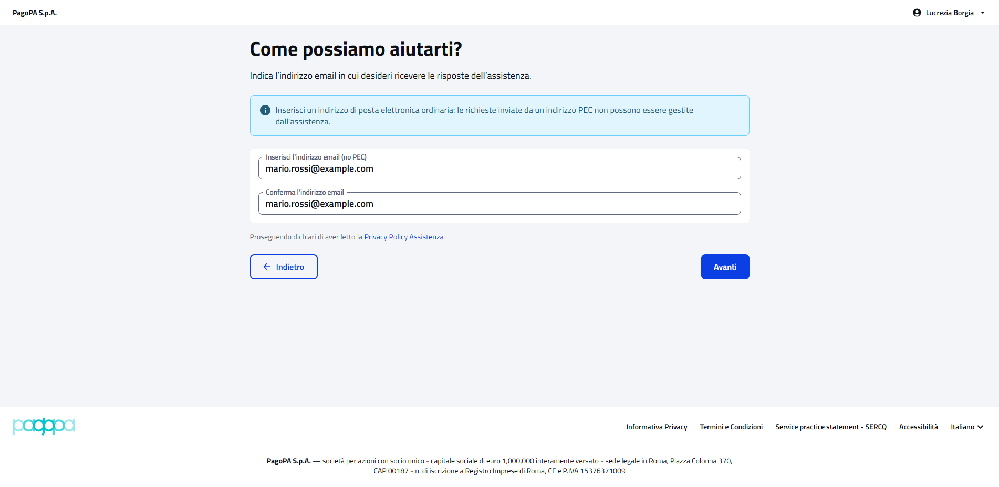

# WebSupportPFContractTest

Contract test della pagina **"Come possiamo aiutarti?"** (assistenza) del cittadino.

- **Indirizzo:** `{baseUrl}/assistenza`, dal link "Assistenza" in alto nella pagina
- **Page Object:** [`SupportPFPage`](../../src/main/java/it/pagopa/send/web/destinatario_pf/infrastructure/page/SupportPFPage.java)
- **Test:** [`WebSupportPFContractTest`](../../src/test/java/it/pagopa/send/suite/contract/WebSupportPFContractTest.java)
- **Utente:** Lucrezia Borgia (il form è lo stesso per qualunque cittadino)
- **Test di navigazione della pagina:** `WebRecipientPfNavigationContractTest#shouldReachSupportPF`, descritto in
  [WebRecipientPfNavigationContractTest.md](WebRecipientPfNavigationContractTest.md#assistenza)

## Cosa verifica

L'`assertLoaded()` della pagina verifica solo che sia caricata: il titolo e la presenza dei campi e dei pulsanti del
form. Questo contract test verifica tutto il resto:

- i **testi** della pagina e del form (intestazione, avviso sulla PEC, etichette, informativa privacy);
- la presenza dei **pulsanti** e del link alla privacy policy;
- lo **stato iniziale** del form;
- le **validazioni** dei campi e quando "Avanti" si abilita.

## "Avanti" non viene mai premuto

Nessuno scenario invia la richiesta di assistenza. Quando le email sono valide il test verifica solo che "Avanti" sia
abilitato.

I messaggi di errore compaiono quando si esce dal campo, quindi gli scenari di validazione premono TAB dopo aver
compilato il campo.

Regole del form, ricavate dal portale il 06/10/2026:

| Caso | Messaggio | "Avanti" |
|---|---|---|
| form vuoto, oppure solo l'email senza conferma | nessuno | disabilitato |
| email non valida o con spazi all'inizio o alla fine | sotto il campo: "L'indirizzo email non è valido" | disabilitato |
| conferma diversa dall'email, anche solo per le maiuscole | sotto la conferma: "L'indirizzo email di conferma non è uguale all'indirizzo email inserito" | disabilitato |
| email valide e uguali | nessuno | abilitato |

## Scenari

Il test è diviso in quattro gruppi, uno per aspetto della pagina. I nomi sono quelli che compaiono nel report dei
test; i testi attesi sono costanti in cima alla classe.

### Testi della pagina e del form (`shouldShowSupportTexts`)

| Scenario | Cosa verifica |
|---|---|
| intestazione della pagina | titolo e sottotitolo |
| avviso sulla PEC | testo dell'avviso sulla posta elettronica ordinaria |
| etichette dei campi | etichette di email e conferma email |
| informativa privacy | frase "Proseguendo dichiari di aver letto la Privacy Policy Assistenza" |

### Elementi e pulsanti (`shouldShowSupportElements`)

| Scenario | Cosa verifica |
|---|---|
| pulsanti avanti e indietro | pulsanti "Avanti" e "Indietro" |
| link alla privacy policy dell'assistenza | testo del link e indirizzo che termina con `/privacy-policy-assistenza` |

### Stato iniziale del form (`shouldStartWithDefaultValues`)

| Scenario | Cosa verifica |
|---|---|
| campi email vuoti | email e conferma email vuote all'apertura |
| avanti disabilitato | "Avanti" disabilitato all'apertura |

### Validazioni (`shouldValidateSupportForm`)

| Scenario | Cosa verifica |
|---|---|
| email non valida | messaggio di errore sull'email e "Avanti" disabilitato |
| email con spazi all'inizio o alla fine | messaggio di errore sull'email e "Avanti" disabilitato |
| email di conferma diversa | messaggio di errore sulla conferma e "Avanti" disabilitato |
| email di conferma uguale ma con maiuscole diverse | messaggio di errore sulla conferma e "Avanti" disabilitato |
| solo email senza conferma: avanti disabilitato | "Avanti" disabilitato |
| email valide e uguali: avanti abilitato | "Avanti" abilitato |

## Stati verificati

**email non valida**

**email con spazi all'inizio o alla fine**

**email di conferma diversa**

**email di conferma uguale ma con maiuscole diverse**

**email valide e uguali: avanti abilitato**

