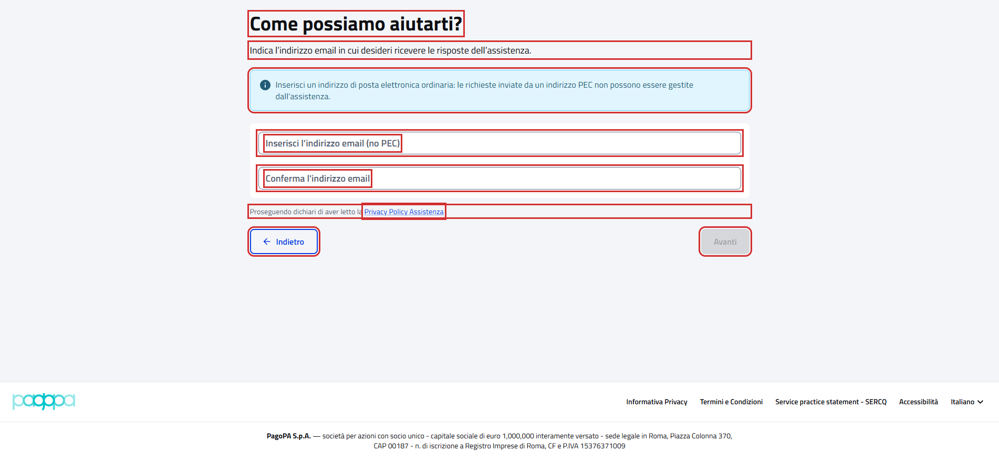

# Come possiamo aiutarti?

Pagina di assistenza `{baseUrl}/assistenza`, dal link "Assistenza" in alto nella pagina.

- Page object: [`SupportPFPage`](../../src/main/java/it/pagopa/send/web/destinatario_pf/infrastructure/page/SupportPFPage.java)
- Test: [`WebSupportPFContractTest`](../../src/test/java/it/pagopa/send/suite/contract/destinatario_pf/WebSupportPFContractTest.java)
- Utente: Lucrezia Borgia (il form è uguale per tutti i cittadini)
- Navigazione: `WebRecipientPfNavigationContractTest#shouldReachSupportPF`, vedi
  [WebRecipientPfNavigationContractTest.md](WebRecipientPfNavigationContractTest.md#assistenza)

## La pagina

In rosso quello che controlla `assertLoaded()`: il titolo, i campi e i pulsanti del form.

## Cosa verifica il contract test

I testi della pagina e del form (avviso sulla PEC, etichette, informativa privacy), i pulsanti, il link alla privacy
policy dell'assistenza, il form vuoto all'apertura e le validazioni. In rosso gli elementi controllati, esclusi i
messaggi.

## Validazioni

Regole del form viste sul portale il 06/10/2026:

| Caso | Messaggio | Avanti |
|---|---|---|
| form vuoto, o email senza conferma | nessuno | disabilitato |
| email non valida o con spazi all'inizio o alla fine | "L'indirizzo email non è valido" | disabilitato |
| conferma diversa dall'email, anche solo per le maiuscole | "L'indirizzo email di conferma non è uguale all'indirizzo email inserito" | disabilitato |
| email valide e uguali | nessuno | abilitato |

## Note

- Il test non preme mai "Avanti": con email valide controlla solo che sia abilitato.
- I messaggi compaiono uscendo dal campo, per questo il test preme TAB dopo averlo compilato.
