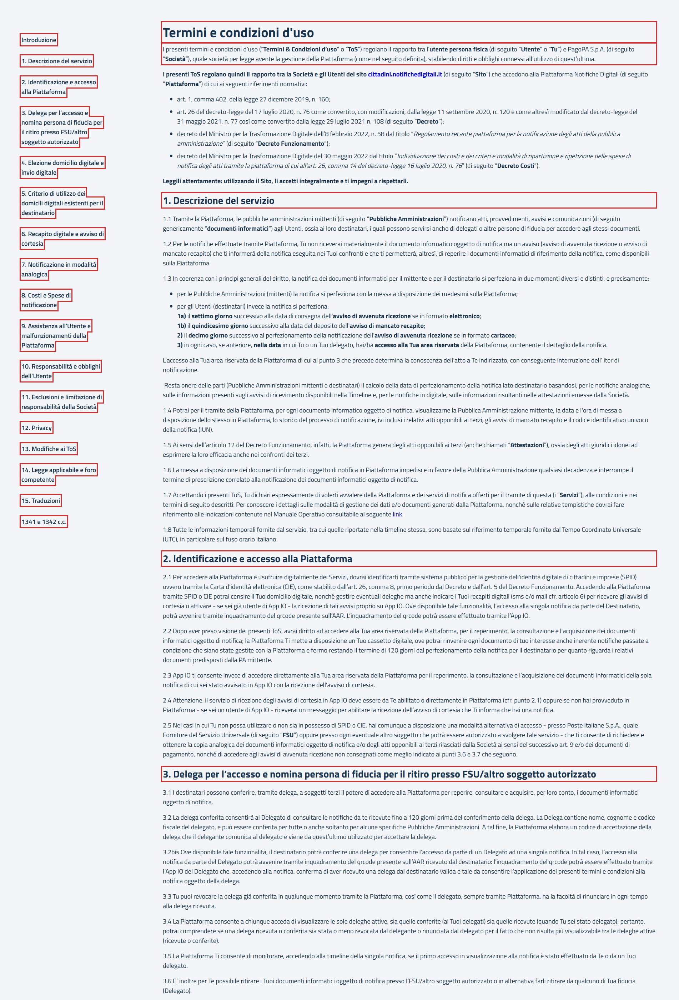

# Termini e condizioni d'uso

Pagina `{baseUrl}/termini-di-servizio`, dal link "Termini e Condizioni" nel footer del portale.

- Page object: [`TermsOfServicePFPage`](../../src/main/java/it/pagopa/send/web/destinatario_pf/infrastructure/page/TermsOfServicePFPage.java)
- Test: [`WebTermsOfServicePFContractTest`](../../src/test/java/it/pagopa/send/suite/contract/destinatario_pf/WebTermsOfServicePFContractTest.java)
- Utente: Lucrezia Borgia (la pagina è uguale per tutti i cittadini)
- Navigazione: `WebRecipientPfNavigationContractTest#shouldReachTermsOfServicePF`, vedi
  [WebRecipientPfNavigationContractTest.md](WebRecipientPfNavigationContractTest.md#termini-di-servizio)

## La pagina

In rosso quello che controlla `assertLoaded()`: il titolo e la presenza di almeno una sezione.

## Cosa verifica il contract test

Il titolo, l'inizio dell'introduzione, i titoli delle 15 sezioni e l'indice: le voci, nell'ordine, e il link di ognuna
a una sezione della pagina (`#otnotice-section-…`). In rosso gli elementi controllati.

## Note

- Il testo è un documento legale caricato da un widget OneTrust. I titoli sono confrontati esattamente: se il documento
  cambia, il test va aggiornato.
- La pagina ha due indici, uno per desktop e uno nascosto per mobile. Il test usa quello per desktop.
