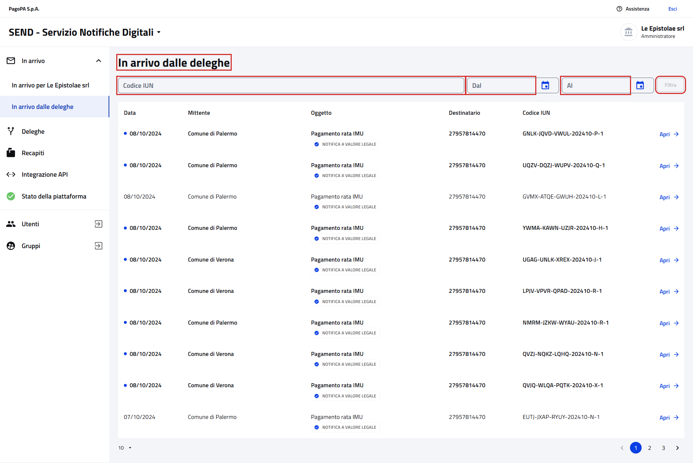
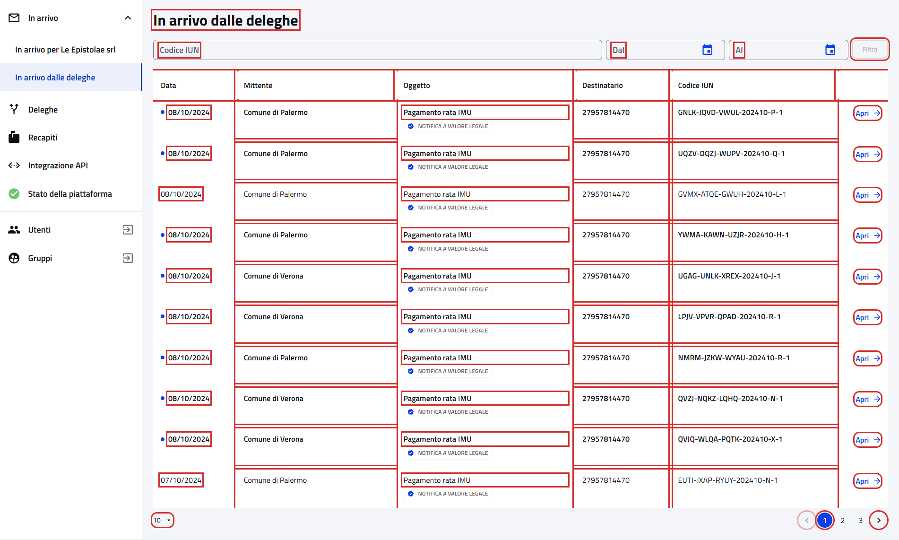

# In arrivo dalle deleghe

Pagina `{baseUrl}/notifiche-delegato`: le notifiche dei deleganti che hanno affidato una delega all'impresa. Si apre
dalla voce "In arrivo dalle deleghe" del menu laterale. `{baseUrl}` è la proprietà `url.notifiche.persona-giuridica.base`
del profilo attivo, ad esempio `https://imprese.test.notifichedigitali.it` sul profilo `test`.

- Page object: [`DelegatedNotificationPage`](../../src/main/java/it/pagopa/send/web/destinatario_pg/infrastructure/page/DelegatedNotificationPage.java),
  con i filtri comuni alle altre liste in [`NotificationFiltersPage`](../../src/main/java/it/pagopa/send/web/notification_search/infrastructure/suit/NotificationFiltersPage.java)
- Test: [`WebDelegatedNotificationPGContractTest`](../../src/test/java/it/pagopa/send/suite/contract/destinatario_pg/WebDelegatedNotificationPGContractTest.java),
  con gli scenari dei filtri in [`RecipientNotificationsScenarios`](../../src/test/java/it/pagopa/send/suite/contract/RecipientNotificationsScenarios.java)
- Utente: Francesco Petrarca, amministratore di Le Epistolae srl
- Navigazione: `WebRecipientPgNavigationContractTest#shouldReachDelegatedNotification`

## La pagina

In rosso quello che controlla `assertLoaded()`: il titolo "In arrivo dalle deleghe" e i campi dei filtri.

## Cosa verifica il contract test

Il titolo, le etichette dei filtri, i messaggi dei filtri e la tabella con la paginazione. Rispetto a
[In arrivo per l'impresa](WebNotificationPGContractTest.md) la pagina non ha il filtro "Tipologia" e la tabella ha in
più la colonna "Destinatario", con il codice fiscale del delegante. In rosso gli elementi controllati, esclusi i
messaggi e i menu aperti.

## Note
- Screenshot presi sull'ambiente `test` a 1920x1080. Ultimo aggiornamento: 09/10/2026.
