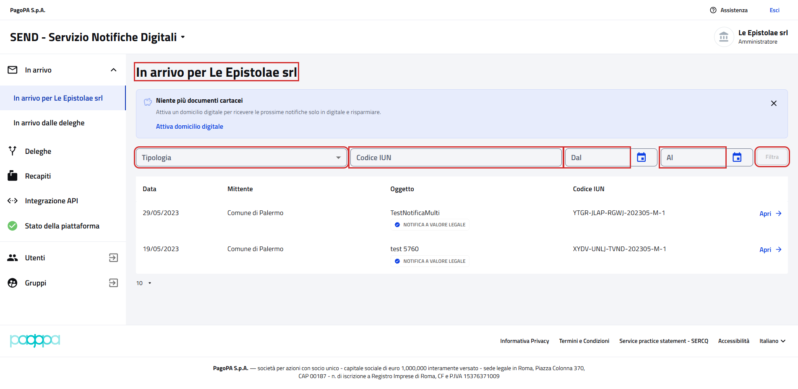
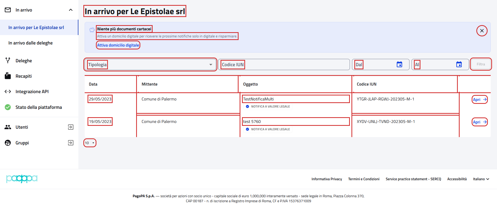

# In arrivo per l'impresa

Pagina `{baseUrl}/notifiche`: si apre dopo il login e dalla voce "In arrivo per &lt;impresa&gt;" del menu laterale.
`{baseUrl}` è la proprietà `url.notifiche.persona-giuridica.base` del profilo attivo, ad esempio
`https://imprese.test.notifichedigitali.it` sul profilo `test`.

- Page object: [`NotificationPage`](../../src/main/java/it/pagopa/send/web/destinatario_pg/infrastructure/page/NotificationPage.java),
  con gli elementi comuni al cittadino in [`RecipientNotificationsPage`](../../src/main/java/it/pagopa/send/web/notification_search/infrastructure/suit/RecipientNotificationsPage.java)
- Test: [`WebNotificationPGContractTest`](../../src/test/java/it/pagopa/send/suite/contract/destinatario_pg/WebNotificationPGContractTest.java),
  con gli scenari comuni in [`RecipientNotificationsScenarios`](../../src/test/java/it/pagopa/send/suite/contract/RecipientNotificationsScenarios.java)
- Utente: Francesco Petrarca, amministratore di Le Epistolae srl
- Navigazione: `WebRecipientPgNavigationContractTest#shouldReachNotifications`

## La pagina

In rosso quello che controlla `assertLoaded()`: il titolo, che inizia con "In arrivo per ", e i campi dei filtri. Lo usa
anche il login PG degli step Cucumber.

## Cosa verifica il contract test

Gli stessi controlli della pagina del cittadino ([WebNotificationPFContractTest](../pagine-pf/WebNotificationPFContractTest.md)),
con il titolo "In arrivo per Le Epistolae srl". In rosso gli elementi controllati, esclusi i messaggi e i menu aperti.

## Note
- Screenshot presi sull'ambiente `test` a 1920x1080. Ultimo aggiornamento: 09/10/2026.
